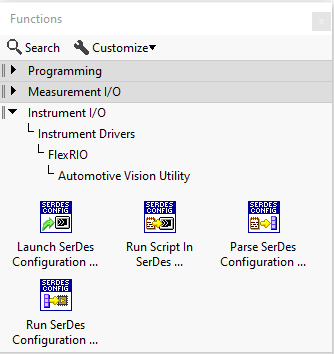
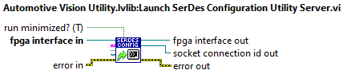
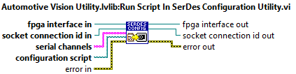
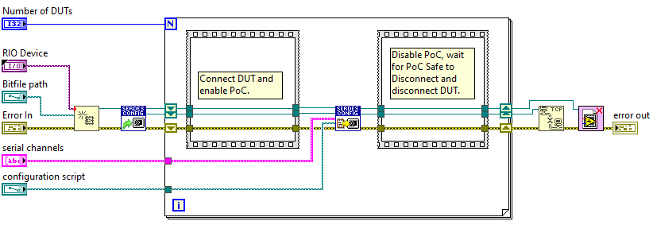
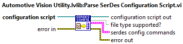
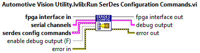

# PXIe-148X Production Test User Guide
{: .no_toc }

This user guide highlights optimizations made to the PXIe-148X module software support to improve the user experience for production test development.

> Note: Software features referenced in this document are included with the NI-FlexRIO 24Q1 driver and later.

### Table of contents
{: .no_toc }

1. TOC
{:toc}

---

## Using the Wait for PoC Safe to Disconnect Feature
Disconnecting and connecting coaxial cables to a PXIe-148X module with power-over-coax (PoC) enabled can result in damaged hardware. The **Wait for PoC safe to Disconnect** function waits and blocks until specified channels with power-over-coax are safe to disconnect to prevent accidental hardware damage. 

### FlexRIO LabVIEW Host API
The **Wait for PoC Safe to Disconnect** LabVIEW VI is located in the Automotive Vision sub-palette of the NI FlexRIO API palette.

The key input parameters for the **Wait for PoC Safe to Disconnect** function are described below. See the LabVIEW context help for complete function documentation.

The **Channels** input parameter accepts a string input type or an array of strings input type. When using the string input type, channels are specified as a single channel such as "SI0", a range such as "SI0-SI3" or a list such as "SI0,SI3". When using the array of strings input type, each element of the array is a single channel such as "SI0", "SO2", etc.

The **Timeout (ms)** input parameter specifies a time limit in milliseconds to wait until safe to disconnect. A value of -1 indicates to wait indefinitely.

    > Warning: Waiting indefinitely causes the LabVIEW VI to hang if the discharge threshold for safe to disconnect is not met.

See the [Power Over Coax](../reference/hardware/powerovercoax.md) reference document for help in determining timeout values.

### LabVIEW Block Diagram Example
The block diagram below provides an example of a production test sequence with the **Wait for PoC Safe to Disconnect** function included.

### Timeout Errors
When a **Wait for PoC Safe to Disconnect** timeout error occurs, the error message provides a list of channels that timed out.

## Optimizing Configuration Script Execution
Optimization of Serializer/Deserializer (SerDes) configuration script execution differs depending on the type of SerDes component being configured, [FPD-Link](#fpd-link) or [GMSL](#gmsl).

### FPD-Link
The FPD-Link SerDes components use configuration scripts with Python (.py) file format. The Python configuration scripts require using the SerDes Configuration Utility. See [Using the SerDes Configuration Utility](#using-the-serdes-configuration-utility) for details. 

### GMSL
The GMSL SerDes components use configuration scripts with C++ (.cpp) file format. GMSL scripts can also be executed through the SerDes Configuration Utility, but can be even further optimized by executing commands within LabVIEW. See [Parsing and Running GMSL Configuration Scripts in LabVIEW](#parsing-and-running-gmsl-configuration-scripts-in-labview) for details.

### Using the SerDes Configuration Utility
The SerDes Configuration Utility is a command line utility that is invoked from within a LabVIEW host VI. A description and usage details for the SerDes Configuration Utility can be found in the [PXIe-148X Configuration Scripts User Guide](../reference/gettingstartedexample/config-scripts-user-guide.md#serdes-configuration-utility).

#### FlexRIO LabVIEW Host Utility VIs
The **Launch SerDes Configuration Utility Server** and **Run Script In SerDes Configuration Utility** LabVIEW VIs used to run scripts in the SerDes Configuration Utility are located in the FlexRIO Automotive Vision Utility palette.

The **Launch SerDes Configuration Utility Server** VI launches the command line utility, which runs as a TCP socket server, then makes a client connection to the server. The TCP socket connection ID is returned through the **socket connection id out** output. The server remains running in the background until the client connection is terminated, either by calling the TCP Close Connection VI or when the LabVIEW process with the client connection is stopped. See the LabVIEW context help for complete function documentation including optional input parameters **tcp socket config**, **verbose (F)** and **output file**.

The **Run Script In SerDes Configuration Utility** VI sends a client command to the SerDes Configuration Utility server to run the specified **configuration script** on the I2C bus instances associated with each serial channel included in the **serial channels** input parameter. See the LabVIEW context help for complete function documentation.

#### LabVIEW Block Diagram Example
The block diagram below provides an example of a production test sequence using the SerDes Configuration Utility. Notice that the SerDes Configuration Utility is launched one time and used to run the configuration script on multiple devices under test (DUTs). The SerDes Configuration Utility opens a FlexRIO FPGA session, which introduces significant overhead. By keeping the server open while testing multiple DUTs, the overhead is only incurred once.

### Parsing and Running GMSL Configuration Scripts in LabVIEW
GMSL scripts do not contain any conditional logic that requires running through the SerDes Configuration Utility. Therefore, GMSL scripts can be parsed as text into a sequence of I2C commands and executed in LabVIEW using the FlexRIO I2C API functions, which eliminates the dependency and additional overhead of the SerDes Configuration Utility.

#### FlexRIO LabVIEW Host Utility VIs
The **Parse SerDes Configuration Script** and **Run SerDes Configuration Commands** LabVIEW VIs used to run GMSL scripts within LabVIEW are located in the FlexRIO Automotive Vision Utility palette.

The **Parse SerDes Configuration Script** VI parses a GMSL configuration script (.cpp file format) and returns and array of SerDes configuration commands through the **serdes config commands** output. Commands in the GMSL script consist of I2C write, I2C transfer or wait commands. See the LabVIEW context help for complete function documentation.

The **Run SerDes Configuration Commands** VI runs a sequence of SerDes configuration commands defined in the **serdes config commands** input on the I2C bus instances associated with each serial channel included in the **serial channels** input parameter. Enabling the **enable debug output (F)** input parameter creates an array of **debug output** strings. The formate of the debug output strings matches exactly the verbose output provided by the SerDes Configuration Utility.

#### LabVIEW Block Diagram Example
TODO - Add this section

## Creating a Custom Configuration Script Format
Regardless of the SerDes component type, a custom configuration script format can be created with minimal additional effort. The benefits of custom configuration scripts include:
- Eliminates dependency and additional overhead of the SerDes Configuration Utility
- Simple, readable configuration script file format
- Can be run on any SerDes type
  
TODO - Finish section