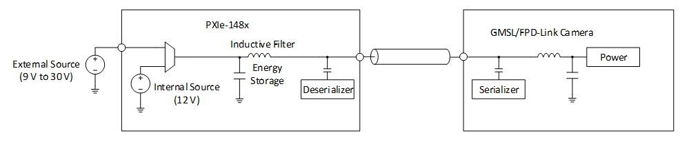
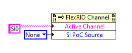
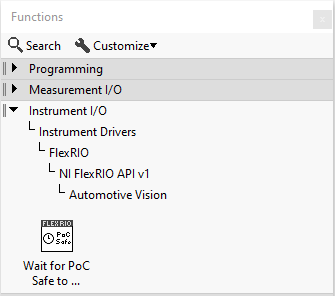
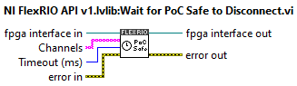
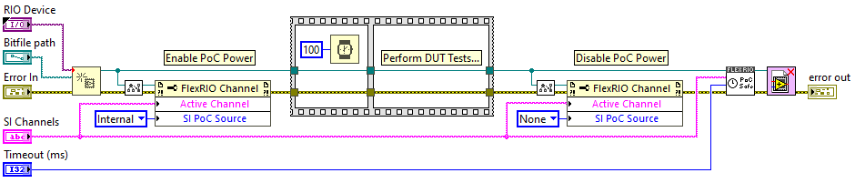
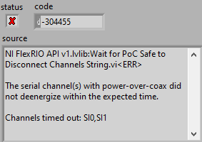
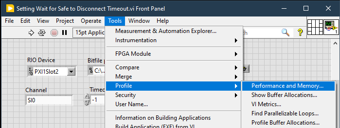
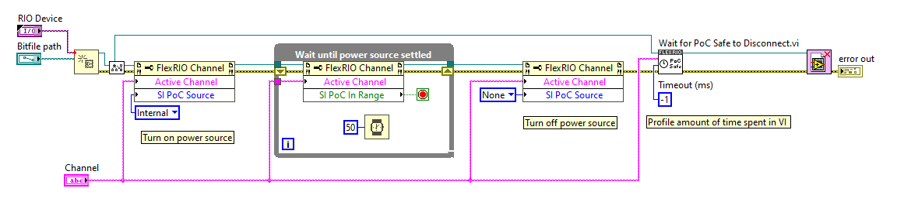
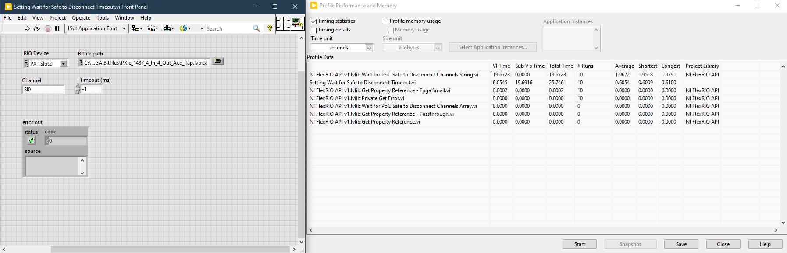

# Power Over Coax (PoC)
{: .no_toc }

### Table of contents
{: .no_toc }

1. TOC
{:toc}

---

## Introduction
GMSL and FPD-Link cameras can be powered over the serial link coax cable through an inductive filter that isolates the DC power from the high-speed serial data.

The inductive filters and power supply capacitance store energy during normal operation. The coax cable will charge up to the DC voltage of the power source such as +12 V when using A PXIe-148x's deserializer channel internal source and DC current will flow through the inductive filters. 

The GMSL and FPD-Link standards do not support hot-plug or hot-disconnect capability. Connecting or disconnecting the coax cable while the power source is energized or even when there is still energy stored in the filters can lead to hardware damage.

To prevent damage, turn off the power source and wait until the channel has discharged before disconnecting the coax cable. When using a PXIe-148x deserializer channel, turn the power source off by setting the FlexRIO Channel property `SI PoC Source` to `None`.

After turning off the power source, the electronics in the PXIe-148x and camera will dissipate the stored energy discharging the coax cable to a safe-to-disconnect state of 0 V. The amount of time it takes to reach the safe-to-disconnect state depends on the amount of stored energy and will vary between PXIe-148x and camera models. The FlexRIO LabVIEW Host API now has a function called **Wait for PoC safe to Disconnect** that helps determine when it is safe to disconnect.

## Wait for Safe to Disconnect
The **Wait for PoC safe to Disconnect** function waits and blocks until specified channels with power-over-coax are safe to disconnect to prevent accidental hardware damage. 

### FlexRIO LabVIEW Host API
The **Wait for PoC Safe to Disconnect** LabVIEW VI is located in the NI FlexRIO API Automotive Vision palette.

The key input parameters for the **Wait for PoC Safe to Disconnect** function are described below. See the LabVIEW context help for complete function documentation.

The **Channels** input parameter accepts a string input type or an array of strings input type. When using the string input type, channels are specified as a single channel such as "SI0", a range such as "SI0-SI3" or a list such as "SI0,SI3". When using the array of strings input type, each element of the array is a single channel such as "SI0", "SO2", etc.

The **Timeout (ms)** input parameter specifies a time limit in milliseconds to wait until safe to disconnect. A value of -1 indicates to wait indefinitely.

> Warning: Waiting indefinitely causes the LabVIEW VI to hang if the discharge threshold for safe to disconnect is not met.

> See the [Power Over Coax](../../reference/hardware/powerovercoax.md#setting-the-timeout) reference document for help in determining timeout values.

### LabVIEW Block Diagram Example
The block diagram below provides an example of a production test sequence with the **Wait for PoC Safe to Disconnect** function included.

### Timeout Errors
When a **Wait for PoC Safe to Disconnect** timeout error occurs, the error message provides a list of channels that timed out.

### Setting the timeout
The correct timeout value for a given pair of PXIe-148x and camera models requires characterization. It is possible to set the timeout to -1 which disables the timeout allowing characterization of the discharge time. One approach is to use LabVIEW's Performance profiler found under the Tools/Profile/Performance and Memory... menu.

The LabVIEW code will look like:

An example run of the profiler shows that the discharge time is 1.97 s for the PXIe-1487 connected to a Leopard Imaging IMX490 camera.

NI recommends characterizing several units and statistical analysis to set the timeout for production test. NI has observed a range of 2 s to 10 s for several different combinations of PXIe-148x and camera models.
