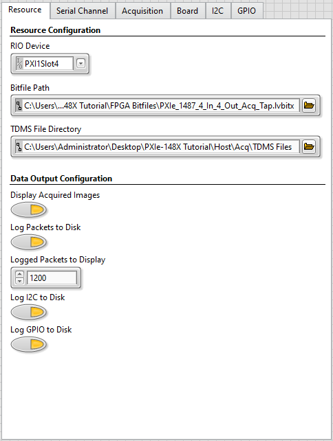

# PXIe-148X Getting Started Example - Basic Acquisition Tutorial

This tutorial will teach you the steps needed to configure an acquisition using a PXIe-148X module with a Leopard Imaging IMX490 camera and familiarize you with the basic functionality provided by the Acquisition Getting Started Example.

> Note: This document references the example included with the NI-FlexRIO 22Q3 driver. Examples included in newer releases of the driver should be applicable.

## Prerequisites

Review and complete all setup from the [PXIe-1486 Getting Started Guide](https://www.ni.com/docs/en-US/bundle/pxie-1486-getting-started/) or [PXIe-1487 Getting Started Guide](https://www.ni.com/docs/en-US/bundle/pxie-1487-getting-started/).

Basic knowledge of LabVIEW and LabVIEW FPGA concepts. 

A supported interface module and camera on a PXI system running Windows.

| **Interface Module**   | **Camera**                                                                                                                            |
|------------------------|---------------------------------------------------------------------------------------------------------------------------------------|
| PXIe-1486 (8 In)       | [LI-IMX490-FPDLINKIII](https://www.leopardimaging.com/product-category/autonomous-camera/ti-fpdlinkiii-cameras/li-imx490-fpdlinkiii/) |
| PXIe-1486 (4 In 4 Out) | [LI-IMX490-FPDLINKIII](https://www.leopardimaging.com/product-category/autonomous-camera/ti-fpdlinkiii-cameras/li-imx490-fpdlinkiii/) |
| PXIe-1487 (8 In)       | [LI-IMX490-GMSL2](https://www.leopardimaging.com/product-category/autonomous-camera/maxim-gmsl2-cameras/li-imx490-gmsl2/)             |
| PXIe-1487 (4 In 4 Out) | [LI-IMX490-GMSL2](https://www.leopardimaging.com/product-category/autonomous-camera/maxim-gmsl2-cameras/li-imx490-gmsl2/)             |

## Initial Hardware Setup

1.  First complete installation of hardware as described in the Getting Started Guide linked above.
2.  Connect the camera to serial input channel 0 (SI0) on the interface module with a FAKRA cable

## Initial Software Setup

1.  First complete installation of software specified in the Getting Started Guide linked above.
2.  Use the NI Example Finder to create a default project for your specific interface module.
    - Open LabVIEW and click **Help -> Find Examples...**
    
    
    - In the NI Example Finder dialog, double-click **Hardware Input and Output -> FlexRIO -> Integrated IO -> Getting Started -> Getting Started FlexRIO Integrated IO.vi**
    
    - In the FlexRIO with Integrated IO Project Creator dialog set the **Project Name** to PXIe-148X Tutorial and make the **FlexRIO Integrated IO** selection for the desired PXIe-148X interface module then click **OK**.
    

3.  Double click the Acquisition Example VI in the LabVIEW project.

    

    > The opened front panel of the Getting Started Example is similar to the figure below.

    

## Performing a Simple Continuous Acquisition

> Note: For the purposes of this tutorial, all input control values not specified should be left as the default value.

1.  Select the **Resource** tab and make the following modifications.
    - Select the **RIO Device** from the dropdown menu that corresponds to your interface module.
    - Set the **Bitfile Path** to the bitfile that corresponds to your interface module. The default shipping bitfile is in the 'FPGA Bitfiles' subfolder located in the project folder (created at the Project Root location specified in Project Creator):

    | **Interface Module**   | **Bitfile**                                          |
    |------------------------|------------------------------------------------------|
    | PXIe-1486 (8 In)       | FPGA Bitfiles\\PXIe_1486_8\_In.lvbitx                |
    | PXIe-1486 (4 In 4 Out) | FPGA Bitfiles\\PXIe_1486_4\_In_4\_Out_Acq_Tap.lvbitx |
    | PXIe-1487 (8 In)       | FPGA Bitfiles\\PXIe_1487_8\_In.lvbitx                |
    | PXIe-1487 (4 In 4 Out) | FPGA Bitfiles\\PXIe_1487_4\_In_4\_Out_Acq_Tap.lvbitx |

    > The values on the **Resource** tab of **Configuration Settings** are now similar to the figure below.

    

2.  Select the **Serial Channel** tab and make the following modifications.
    - Select the **Configuration Script** that corresponds to your interface module. The scripts are used to configure the deserializer on the interface module as well as the serializer and image sensor on the camera. The configuration scripts required for this tutorial are in the project folder under the subfolder 'Host\\Scripts':

        | **Interface Module**   | **Configuration Script**                                           |
        |------------------------|--------------------------------------------------------------------|
        | PXIe-1486 (8 In)       | Host\\Scripts\\DS90UB954\\Acq\\LI\\IMX490_2880x1280_RAW12.py       |
        | PXIe-1486 (4 In 4 Out) | Host\\Scripts\\DS90UB954\\Acq\\LI\\IMX490_2880x1280_RAW12.py       |
        | PXIe-1487 (8 In)       | Host\\Scripts\\MAX9296A\\Acq\\LI\\IMX490_2880x1280_RAW12_ID1_A.cpp |
        | PXIe-1487 (4 In 4 Out) | Host\\Scripts\\MAX9296A\\Acq\\LI\\IMX490_2880x1280_RAW12_ID1_A.cpp |

    > The values on the **Serial Channel** tab of **Configuration Settings** are now similar to the figure below.

    

3.  Select the **Board** tab and make the following modifications.
    - In the **Power Over Coax Source** drop down menu, select **Internal** to power the attached camera from the interface module's internal 12V supply.

    > The values on the **Board** tab of **Configuration Settings** are now similar to the figure below.

    

4.  Run the VI to start a continuous acquisition. Images captured from the camera display automatically in the **First Display Channel** tab.
5.  While the VI is running, use the displayed image to focus the camera.

    

6.  Click the **Stop Acquisition** button to stop the acquisition and stop the VI.
7.  (Optional) Update the **Red Gain**, **Green Gain**, and **Blue Gain** display parameters on the **Serial Channel** tab -> **Channel Configurations** control to better match the acquired image to the actual color of the object.

    

8. Rerun the VI to see the impact of the display parameter changes on the image displayed.
    > Note: Changes made to the display parameters while the VI is running will not take effect until the next time the VI is run.

## Performing a Finite Acquisition with Data Logging

> Note: The Finite Acquisition with Data Logging tutorial assumes that all input parameters are still configured as specified in the Simple Continuous Acquisition tutorial.

1.  Select the **Resource** tab and make the following modifications.
    - Enable **Log Packets to Disk**.
    - Enable **Log I2C to Disk**.
    - Enable **Log GPIO to Disk**.

    > Note: During the first run of the VI in the Simple Continuous Acquisition tutorial, the **TDMS File Directory** control was automatically populated with a value pointing to a subfolder (\"TDMS Files\"). This subfolder was automatically created within the project folder to store any generated TDMS files.

    > The values on the **Resource** tab of **Configuration Settings** are now similar to the figure below.
    
    

2.  Select the **Acquisition** tab and disable **Continuous Acquisition**.

    > The values on the **Acquisition** tab of **Configuration Settings** are now similar to the figure below.

    

3.  Select the **I2C** tab and add **User24** to the **timestamp filter** array to enable I2C timestamp logging on the SI0 channel.

    > The values on the **I2C** tab of **Configuration Settings** are now similar to the figure below.

    

4.  Select the **GPIO** tab and make the following modifications.
    - Add a GPIO line to the **GPIO to Display** array with the GPIO Bank value set to **Des0 GPIO** and the GPIO Number set to 0. Setting these values enables display of GPIO traffic for the GPIO 0 line on the SI0 channel connected to the camera.

    > The values on the **GPIO** tab of **Configuration Settings** are now similar to the figure below.

    

5.  Run the VI to start the acquisition and wait for the acquisition to complete. The default acquisition duration of 1 second is run and results are displayed on the various tabs in the **Data Output** indicator.

    > Packet Data is displayed in the **First Serial Channel Packets** tab.
    - The **Bytes Acquired (1st Channel)** indicator updates as the acquisition is occurring.
    - The **Packets Logged (1st Channel)** indicator updates after acquisition completes.
    > See [PXIe-148X Acquisition GSE Help](../../reference/gettingstartedexample/gse-acq-help.md#table-of-descriptions-for-acquired-packets-columns) for **Acquired Packets (1st Channel)** column details.

    

    > I2C timestamp data is displayed in the **I2C Timestamps** tab.

    

8.  GPIO timestamp data is plotted in the **GPIO Timestamps** tab.

    

    > Note: The camera does not toggle GPIOs by default. The change shown in the figure above reflects GPIO level reset when the example VI is first run.

## Reviewing Previously Logged Data

> Note: The Review Previously Logged Data tutorial assumes that the previous tutorials in this document were completed first.

TDMS files containing acquired data from the camera were saved to the \"TDMS Files\" subfolder in the previous tutorial. The GPIO timestamps, user timestamps, and data acquired from the camera are stored in individual TDMS files. You can use the file viewer utility to review the acquired packet data.

1.  Double click the TDMS File Viewer VI in the LabVIEW project.
  
    

    > The opened front panel of the File Viewer will be similar to the figure below.

    

2.  Select the correct location for the **TDMS File Directory** control. By default, TDMS files in the previous tutorial were saved to \<yourprojectdir\>\\Host\\TDMS Files.

    > Note: The directory browse window will not show the TDMS files located in the "TDMS Files" directory.

3.  Run the VI to load the TDMS file and view the packet data.

    

    > Note: The **Update TDMS File Packet Offset Data** control is enabled by default. Enabling this option results in re-saving a TDMS file with additional packet indexing information the first time the TDMS file is loaded. This indexing information can reduce the future load time of the file, particularly when reading only a subset of the packet data.

4. (Optional) Update the **Packet Display Start Index** and **Packets to Display** controls to review a specific packet range of interest from the TDMS file and rerun the VI.

## Related Documents
- [PXIe-148X Getting Started Example - Common Acquisition Tutorials](./gse-acq-common.md)
- [PXIe-148X Getting Started Example - Acquisition Help](../../reference/gettingstartedexample/gse-acq-help.md)
- [PXIe-148X Getting Started Example - Basic Generation Tutorial](./gse-gen-basic.md)
- [PXIe-148X Getting Started Example - Basic Tap Tutorial](./gse-tap-basic.md)

    
