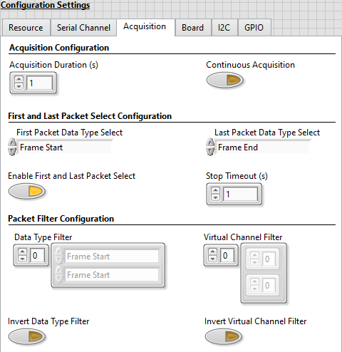
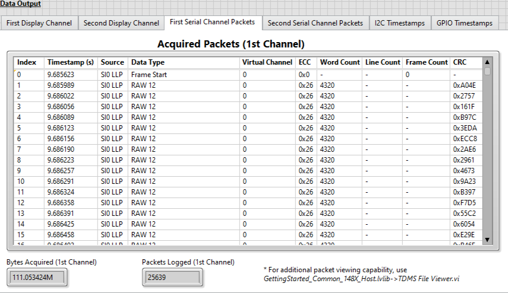
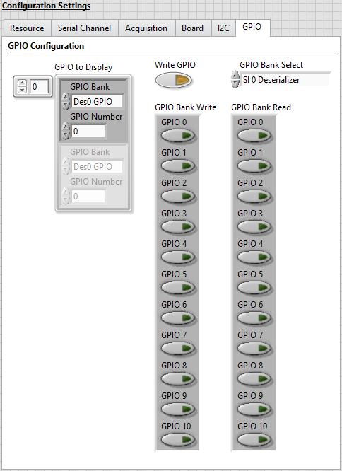
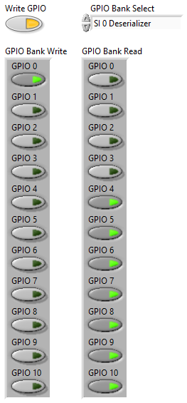
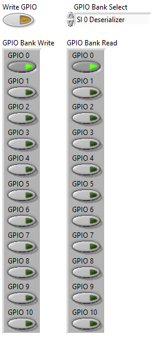
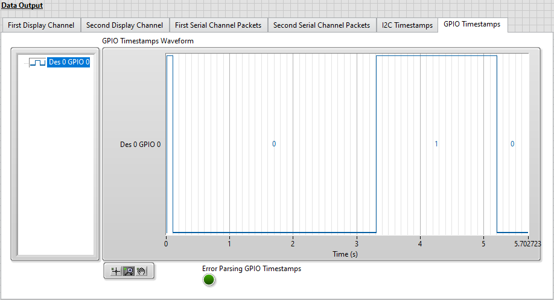

# PXIe-148X Getting Started Example - Common Acquisition Tutorials
{: .no_toc }

This document covers a range of common scenarios using the PXIe-148X Acquisition Getting Started Example (GSE) to help you understand LLP acquisition, I2C and GPIO timestamping, and common configuration options.

> Note: This document references the example included with the NI-FlexRIO 22Q3 driver. Examples included in newer releases of the driver should be appliable.

## Table of contents
{: .no_toc  }

1. TOC
{:toc}

---

## Prerequisites

This tutorial is written for users who understand how to perform a basic acquisition with a PXIe-148X GMSL or FPD-Link interface module. It is recommended to complete the [PXIe-148X Getting Started Example - Basic Acquisition Tutorial](gse-acq-basic.md) before attempting this tutorial.

> Note: The tutorials in this document assume the use of a Leopard Imaging IMX490 camera connected to SI0 of your interface module (see PXIe-148X Getting Started Example - Basic Acquisition Tutorial for specific setup if needed).

## Acquiring and Filtering LLP Packets

This tutorial shows you how to acquire packets from a camera on a serial channel and demonstrates different options for filtering those packets.

1. Set the following controls on the Acquisition Example GSE VI and leave all other values at their defaults.
    > Note: VI controls and indicators can be reset to default values by clicking on the **Edit** menu and selecting the **Reinitialize Values to Default** option.

    | Tab            | Control                 | Value                                                                                                                                                               |
    |----------------|-------------------------|---------------------------------------------------------------------------------------------------------------------------------------------------------------------|
    | Resource       | RIO Device              | [System Specific]                                                                                                                                                   |
    | Resource       | Bitfile Path            | [Refer to Bitfile Path in the PXIe-148X Acquisition GSE Help](../../reference/gettingstartedexample/gse-acq-help.md#table-of-pxie-148x-acquisition-bitfiles)        |
    | Resource       | Display Acquired Images | Disabled                                                                                                                                                            |
    | Resource       | Log Packets to Disk     | Enabled                                                                                                                                                             |
    | Serial Channel | Configuration Script    | [Refer to Configuration Script in the PXIe-148X Acquisition GSE Help](../../reference/gettingstartedexample/gse-acq-help.md#table-of-pxie-148x-acquisition-scripts) |
    | Board          | Power Over Coax Source  | Internal                                                                                                                                                            |

2.  Select the **Acquisition** tab and make the following modifications.

    The **Acquisition** tab configures how the module starts and stops acquiring LLP packets and which packets it keeps in your data path. CSI-2 Packets have data types and virtual channels. You can use these data types and virtual channels to filter out or keep CSI-2 packets.
    - Set the **Acquisition Duration (s)** to 1 second. 
        > With an acquisition duration of 1 second, the global acquisition engine in the FPGA asserts the stop signal 1 second after the acquisition starts. This stop signal notifies all channel acquisition engines to stop acquiring data once its stop conditions are satisfied.
    - Disable **Continuous Acquisition**.
         > Note: If **Continuous Acquisition** is enabled, the acquisition duration is ignored and a stop trigger is generated by clicking the **Stop Acquisition** button.
    - Set **First Packet Data Type Select** to **Frame Start**. 
        > This configures the interface module to filter out any initial packets from the camera until a CSI-2 Frame Start packet is received.
    - Set **Last Packet Data Type Select** to **Frame End**.
        > This configures the interface module to continue acquiring after the acquisition duration completes until a Frame End packet is received.
    - Enable **First and Last Packet Select**.
        > Note: If **First and Last Packet Select** is disabled, **First Packet Data Type Select** and **Last Packet Data Type Select** are ignored.
    - Set the **Stop Timeout** to 1 second. 
        > This is the amount of time to wait for a packet with a data type that matches the Last Packet Data Type Select after the stop signal is asserted either as a result of a stop trigger or the acquisition duration being satisfied.
    - Leave the **Data Type Filter** array empty. 
    - Leave the **Virtual Channel Filter** array empty.
    - Disable **Invert Data Type Filter**.     
    - Disable **Invert Virtual Channel Filter**.

    > The values on the **Acquisition** tab of **Configuration Settings** are now similar to the figure below.

    

3. Run the VI.

4. Click on the **First Serial Channel Packets** tab to view information about the acquired data.

    > The Getting Started Example displays packet data for the first two channels specified in the **Channel Configurations** array at the completion of the acquisition.

    - The **Acquired Packets (1st Channel)** table displays the LLP packet information for the number of packets specified in the **Logged Packets to Display** control.

        > Note: Specifying a large number of packets to display may cause the VI to appear unresponsive for a period of time after the acquisition completes while the packet data is processed. A negative **Logged Packets to Display** value displays all logged packets.
        
        > See [PXIe-148X Acquisition GSE Help](../../reference/gettingstartedexample/gse-acq-help.md#table-of-descriptions-for-acquired-packets-columns) for **Acquired Packets (1st Channel)** column details.

    - The **Bytes Acquired (1st Channel)** indicator updates during the acquisition.
    - The **Packets Logged (1st Channel)** indicator updates after the acquisition completes.

        > Note: The Getting Started Example utility *GettingStarted_Common_148X_Host.lvlib-\>TDMS File Viewer.vi* can be used for viewing packet data logged in an LLP Packets TDMS file.

    

5. Select the **Acquisition** tab and disable **First and Last Packet Select**.

6. Run the VI.

7. Click on the **First Serial Channel Packets** tab to view information about the acquired data.
    - Notice that first packet is not a Frame Start, but instead it is a RAW 12 packet from partway through the frame. Using the **First Packet Data Type Select** is a way to make sure the acquired data starts at the beginning of a frame.

8. Select the **Acquisition** tab and make the following modifications.
    - Enable **First and Last Packet Select**.
    - Enable **Invert Data Type Filter**. 
        >Enabling this setting means packets with data types that match the Data Type Filter are the only packets that will be acquired.

    - Add a **Frame Start** element to the **Data Type Filter** array.

9. Run the VI.

10. Click on the **First Serial Channel Packets** tab to view information about the acquired data.
    - All packets except Frame Start packets are filtered out, so you only see Frame Start packets displayed in the output. You can use the timestamps of these packets to verify the frame rate of the camera data.

11. Select the **Acquisition** tab and make the following modifications.
    - Add a RAW12 element to the **Data Type Filter** array in addition to the existing Frame Start element.
    - Disable **Invert Data Type Filter**. 
        > Disabling this setting means packets with data types that match the **Data Type Filter** array will be filtered out.

12. Run the VI.

13. Click on the **First Serial Channel Packets** tab to view information about the acquired data.
    > The Frame Start and RAW12 packets are filtered out, so the only packets displayed are Frame End packets. You can use the timestamps of these packets to verify the frame rate of the camera data.

## Setting FPGA Display Parameters

This tutorial shows you how to configure the **FPGA Display Parameters** to change the images being displayed from the camera.

1. Set the following controls on the Acquisition Example GSE VI and leave all other values at their defaults.
    > Note: VI controls and indicators can be reset to default values by clicking on the **Edit** menu and selecting the **Reinitialize Values to Default** option.

    | Tab            | Control                 | Value                                                                                                                                                               |
    |----------------|-------------------------|---------------------------------------------------------------------------------------------------------------------------------------------------------------------|
    | Resource       | RIO Device              | [System Specific]                                                                                                                                                   |
    | Resource       | Bitfile Path            | [Refer to Bitfile Path in the PXIe-148X Acquisition GSE Help](../../reference/gettingstartedexample/gse-acq-help.md#table-of-pxie-148x-acquisition-bitfiles)        |
    | Resource       | Log Packets to Disk     | Enabled                                                                                                                                                             |
    | Serial Channel | Configuration Script    | [Refer to Configuration Script in the PXIe-148X Acquisition GSE Help](../../reference/gettingstartedexample/gse-acq-help.md#table-of-pxie-148x-acquisition-scripts) |
    | Acquisition    | Acquisition Duration    | 5 seconds                                                                                                                                                           |
    | Acquisition    | Continuous Acquisition  | Disabled                                                                                                                                                            |
    | Board          | Power Over Coax Source  | Internal                                                                                                                                                            |

### Displaying Acquired Images

1.  Select the **Serial Channel** tab and make the following modifications.

    The **FPGA Display Parameters** determine what data is sent to the host for display, and the **RAW Display Parameters** determine how image data for RAW data types is decoded. Display parameters _only_ affect the image on the display channel, not any data logged to disk.

    The **Channel Configurations** control is used to select active channels and configure display parameters if enabled.

    Set the **Channel Configurations** array to contain one element with the following sub-settings.

    - Set the **Serial Channel** control to SI0.
    - Set the **virtual channel** to 0.
    - Set the **payload data type** to **RAW 12**.

    > Note: The **virtual channel** and **payload data type** must match the virtual channel and data type of the LLP packets that contain the image data you want to display. The settings above are optimal for running this example with a Leopard Imaging IMX490 camera.

    > The values on the **Serial Channel** tab of **Configuration Settings** are now similar to the figure below.

    

2. Run the VI.

3. Select the **First Display Channel** tab and verify that images from the camera are displayed on this tab. 

    - Note the two FPS indicators. The **Source Rate (fps)** indicator displays the frame rate in frames per second at which the image data is being received. The **Update Rate (fps)** indicator displays the rate in frames per second at which the image display indicator is being updated.

4. Select the **Serial Channel** tab and make the following modifications.
    - Set the **virtual channel** to 1.

5. Run the VI and verify that no images are displayed on the **First Display Channel** tab since the **virtual channel** value does not match the value in the packets received from the camera. 

6. Select the **Serial Channel** tab and make the following modifications.
    - Set the **virtual channel** to 0.
    - Set the **payload data type** to **RAW 10**.

7. Run the VI and verify that no images are displayed on the **First Display Channel** tab since the **payload data type** value does not match the value in the packets received from the camera.

8. Select the **Serial Channel** tab and make the following modifications.
    - Set the **payload data type** to **RAW 12**.

9. Run the VI and verify that images are once again displayed on the **First Display Channel** tab since the **virtual channel** and **payload data type** values now match the values in the packets received from the camera.

### Reducing System Bandwidth Usage
This section demonstrates useful techniques for reducing the system bandwidth needed to transfer data from the FPGA to the host.

> Note: If the **Update Rate (fps)** indicator is significantly less than the **Source Rate (fps)** indicator, the system is struggling to display images at the rate it receives them. Reducing resolution or skipping frames are two techniques to help resolve this issue.

#### Reducing Horizontal Resolution

1. Run the VI.
    - Select the **First Display Channel** tab and note the resolution displayed under the image.
    - Select the **First Serial Channel Packets** tab and note the **Word Count** (bytes) for each RAW 12 packet type displayed in the **Acquired Packets (1st Channel)** table.

2. Select the **Serial Channel** tab and make the following modifications.
    - Set the **pixel skip count** to 2. This causes the display to keep 1 pixel and discard the next 2 and reduces the horizontal resolution of your display image to 1/3 its original size.

        > Note: For Bayer encoded images even numbers are recommended for pixel skip count to prevent discarding all of the pixels associated with a given color component.

3. Run the VI.

    > The image display is changed, but the LLP packet data logged to disk is unaffected.

    - Select the **First Display Channel** tab and observe the change to the horizontal resolution for the image.
    - Select the **First Serial Channel Packets** tab and observe the **Word Count** (bytes) for each RAW 12 packet type is unchanged.

#### Reducing Vertical Resolution

1. Run the VI.
    - Select the **First Display Channel** tab and note the resolution displayed under the image.
    - Select the **First Serial Channel Packets** tab and note the number of packets per frame by scrolling down in the **Acquired Packets (1st Channel)** table to the first packet with a **Data Type** of Frame End.

2. Select the **Serial Channel** tab and make the following modifications.
    - Set the **line skip count** to 2. This will cause the display to keep 1 line and discard 2 lines and reduces the vertical resolution of your display image to 1/3 it's original size.

        > Note: For Bayer encoded images even numbers are recommended for line skip count to prevent discarding all of the pixels associated with a given color component.

3. Run the VI.

    > The image display is changed, but the LLP packet data logged to disk is unaffected.

    - Select the **First Display Channel** tab and observe the change to the vertical resolution for the image.
    - Select the **First Serial Channel Packets** tab and observe the number of packets per frame is unchanged.

#### Reducing the Frame Rate

1. Run the VI.
    - Select the **First Display Channel** tab and note the **Source Rate (fps)(1st Display)** indicator value.
    - Select the **First Serial Channel Packets** tab and note frame period, which is the timestamp difference between sequential Frame Start packets in the **Acquired Packets (1st Channel)** table. 

        `Frame Period (s) = Frame Start timestamp 1 - Frame Start timestamp 0`

    - (Optional) Calculate the frame rate of the image data received from the camera by dividing 1 by the frame period. With a **frame skip count** of 0, the calculated frame rate matches the **Source Rate (fps)(1st Display)** indicator value.

        `Frame Rate (fps) = 1 / Frame Period`

2. Select the **Serial Channel** tab and make the following modifications.
    - Set the **frame skip count** to 1. This causes the display to keep 1 frame and discard the next 1 and reduces the FPS of your display image to 1/2 it's original rate.

3. Run the VI.
    - Select the **First Display Channel** tab and observe the change to the **Source Rate (fps)(1st Display)** indicator value.
    - Select the **First Serial Channel Packets** tab and observe the frame period is unchanged.

## Setting RAW Display Parameters

This tutorial shows you how to configure the **RAW Display Parameters** to change the interpretation of images being displayed from the camera that are being sent in RAW packets.

1. Set the following controls on the Acquisition Example GSE VI and leave all other values at their defaults.
    > Note: VI controls and indicators can be reset to default values by clicking on the **Edit** menu and selecting the **Reinitialize Values to Default** option.

    | Tab            | Control                 | Value                                                                                                                                                               |
    |----------------|-------------------------|---------------------------------------------------------------------------------------------------------------------------------------------------------------------|
    | Resource       | RIO Device              | [System Specific]                                                                                                                                                   |
    | Resource       | Bitfile Path            | [Refer to Bitfile Path in the PXIe-148X Acquisition GSE Help](../../reference/gettingstartedexample/gse-acq-help.md#table-of-pxie-148x-acquisition-bitfiles)        |
    | Serial Channel | Configuration Script    | [Refer to Configuration Script in the PXIe-148X Acquisition GSE Help](../../reference/gettingstartedexample/gse-acq-help.md#table-of-pxie-148x-acquisition-scripts) |
    | Acquisition    | Acquisition Duration    | 5 seconds                                                                                                                                                           |
    | Acquisition    | Continuous Acquisition  | Disabled                                                                                                                                                            |
    | Board          | Power Over Coax Source  | Internal                                                                                                                                                            |

2.  Select the **Serial Channel** tab and make the following modifications.

    The **FPGA Display Parameters** determine what data is sent to the host for display, and the **RAW Display Parameters** determine how image data for RAW data types is decoded. Display parameters _only_ affect the image on the display channel, not any data logged to disk.

    The **Channel Configurations** control is used to select active channels and configure display parameters if enabled.

    Set the **Channel Configurations** array to contain one element with the following sub-settings.

    - Set the **Serial Channel** control to SI0.
    - Set the **payload data type** to **RAW 12**.

    > The values on the **Serial Channel** tab of **Configuration Settings** are now similar to the figure below.

    
	
	Set the **RAW Display Parameters** to the following sub-settings.
	
	- Set the **Interpretation** control to RGB.
	
	> Note: The **Interpretation** , **Pattern** , and **Algorithm** must match the data encoding of LLP packets that contain the image data you want to display. If these do not match the data in the LLP packets, the image display looks distorted or incorrect.

3. Run the VI.

   - Select the **First Display Channel** tab and observe the image displayed is distorted.
   
4.  Select the **Serial Channel** tab and make the following modifications.

    Set the **RAW Display Parameters** to the following sub-settings.
	
	- Set the **Interpretation** control to Bayer.
	- Set the **Pattern** control to GB.
	
5. Run the VI.

   - Select the **First Display Channel** tab and observe the image displayed is colorized incorrectly.
   
6.  Select the **Serial Channel** tab and make the following modifications.

    Set the **RAW Display Parameters** to the following sub-settings.
	
	- Set the **Interpretation** control to Bayer.
	- Set the **Pattern** control to RG.
	
7. Run the VI.

   - Select the **First Display Channel** tab and observe the image displayed looks correct. The **RAW Display Parameters** now match the RAW 12 packet data from the Leopard Imaging IMX490 camera.

## Setting Serial Channel Configurations

This tutorial shows you how to configure the **Serial Channel** tab to acquire multiple images from multiple camera sensors.

> Note: This tutorial requires the use of two Leopard Imaging IMX490 cameras connected to SI0 and SI1 of your interface module.

1. Set the following controls on the Acquisition Example GSE VI and leave all other values at their defaults.
    > Note: VI controls and indicators can be reset to default values by clicking on the **Edit** menu and selecting the **Reinitialize Values to Default** option.

    | Tab            | Control                 | Value                                                                                                                                                               |
    |----------------|-------------------------|---------------------------------------------------------------------------------------------------------------------------------------------------------------------|
    | Resource       | RIO Device              | [System Specific]                                                                                                                                                   |
    | Resource       | Bitfile Path            | [Refer to Bitfile Path in the PXIe-148X Acquisition GSE Help](../../reference/gettingstartedexample/gse-acq-help.md#table-of-pxie-148x-acquisition-bitfiles)        |
    | Serial Channel | Configuration Script    | [Refer to Configuration Script in the PXIe-148X Acquisition GSE Help](../../reference/gettingstartedexample/gse-acq-help.md#table-of-pxie-148x-acquisition-scripts) |
    | Acquisition    | Acquisition Duration    | 5 seconds                                                                                                                                                           |
    | Acquisition    | Continuous Acquisition  | Disabled                                                                                                                                                            |
    | Board          | Power Over Coax Source  | Internal                                                                                                                                                            |

### Displaying Acquired Images From Multiple Cameras

1.  Select the **Serial Channel** tab and make the following modifications.

    The **Channel Configurations** control is used to select active channels and configure display parameters if enabled.

    Set the **Channel Configurations** array to contain two elements. Configure the first element with the following sub-settings.

    - Set the **Serial Channel** control to SI0.
    - Set the **payload data type** to **RAW 12**.
	
	Configure the second element with the following sub-settings.
	
	- Set the **Serial Channel** control to SI1.
    - Set the **payload data type** to **RAW 12**.

    > The values on the **Serial Channel** tab of **Configuration Settings** are now similar to the figure below.

    

2. Run the VI.

   - Select the **First Display Channel** tab and observe the image from the Leopard Imaging IMX490 camera connected to SI0.
   - Select the **Second Display Channel** tab and observe the image from the Leopard Imaging IMX490 camera connected to SI1.

### Running the Pattern Generation Script for an FPD-Link Interface Device
This section demonstrates running a script that has the camera sensor generate an RGB pattern instead of captured images. This functionality is only supported on the FPD-Link interface devices.

1.  Select the **Serial Channel** tab and make the following modifications.

    Set the **Configuration Script** to /Host/Scripts/DS90UB954/Acq/953_1920x1080_RAW12_PatGen.py
	
	> Note: This will configure any DS90UB953 serializer in pattern generation mode. In this setup we are configuring the two Leopard Imaging IMX490 cameras to generate patterns.

2. Run the VI.

   - Select the **First Display Channel** tab and observe the image from the Leopard Imaging IMX490 camera connected to SI0 is displaying a ramp pattern.
   - Select the **Second Display Channel** tab and observe the image from the Leopard Imaging IMX490 camera connected to SI1 is displaying a ramp pattern.

## Acquiring and Displaying I2C Timestamps
This tutorial shows how to acquire and view I2C timestamps on the PXIe-148X interface module.

> Note: Timestamps are relative to a time immediately after the FPGA bitfile is downloaded and run, not the start of the acquisition. This allows capturing I2C and GPIO timestamps during configuration before the acquisition starts.

1. Set the following controls on the Acquisition Example GSE VI and leave all other values at their defaults.
    > Note: VI controls and indicators can be reset to default values by clicking on the **Edit** menu and selecting the **Reinitialize Values to Default** option.

    | Tab            | Setting                 | Value                                                                                                                                                               |
    |----------------|-------------------------|---------------------------------------------------------------------------------------------------------------------------------------------------------------------|
    | Resource       | RIO Device              | [System Specific]                                                                                                                                                   |
    | Resource       | Bitfile Path            | [Refer to Bitfile Path in the PXIe-148X Acquisition GSE Help](../../reference/gettingstartedexample/gse-acq-help.md#table-of-pxie-148x-acquisition-bitfiles)        |
    | Resource       | Display Acquired Images | Disabled                                                                                                                                                            |
    | Resource       | Log I2C to Disk         | Enabled                                                                                                                                                             |
    | Serial Channel | Configuration Script    | [Refer to Configuration Script in the PXIe-148X Acquisition GSE Help](../../reference/gettingstartedexample/gse-acq-help.md#table-of-pxie-148x-acquisition-scripts) |
    | Acquisition    | Continuous Acquisition  | Disabled                                                                                                                                                            |
    | Board          | Power Over Coax Source  | Internal                                                                                                                                                            |

2.  Select the **I2C** tab and make the following modifications.

    > The I2C tab only has one control, the I2C **timestamp filter**. This filter contains an array of timestamp IDs. **User24** represents the I2C traffic on serial channel 0 (SI0), **User25** represents the I2C traffic on serial channel 1 (SI1), and so on.
    - Set the **timestamp filter** array to contain only the **User24** timestamp ID. This will let you see the I2C traffic on SI0. If you run the VI with a configuration script selected, you will see configuration traffic in the I2C Data Output tab after the VI has stopped.

    

3.  Run the VI. 
4.  Select the **I2C Timestamps** tab to view I2C timestamp data.
    - View the displayed I2C timestamp data in the **I2C Timestamps** table. The **I2C Timestamps** table displays I2C timestamp information for all I2C traffic. I2C timestamps begin logging immediately after the FPGA bitfile is downloaded and include timestamp data prior to the start of the LLP packet data acquisition (i.e. I2C traffic from the configuration script).

        > Note: To display I2C timestamp data, **Log I2C to Disk** must be enabled and desired timestamp IDs must be added to the **timestamp filter** array. The I2C timestamp data displayed is read from the User_Timestamps.tdms file and filtered to display only timestamp IDs included in the timestamp filer array. The **I2C Timestamps** display is updated after the acquisitions completes.

    

## Manually Reading and Writing to GPIO

This tutorial shows how to manually read and write to the GPIO banks on the PXIe-148X interface module and display the digital waveform of the GPIO lines. This tutorial modifies GPIO line values  while the acquisition is running and logs the GPIO timestamps to disk.

> Note: Timestamps are relative to a time immediately after the FPGA bitfile is downloaded and run, not the start of the acquisition. This allows capturing I2C and GPIO timestamps during configuration before the acquisition starts.

1. Set the following controls on the Acquisition Example GSE VI and leave all other values at their defaults.
    > Note: VI controls and indicators can be reset to default values by clicking on the **Edit** menu and selecting the **Reinitialize Values to Default** option.

    | Tab            | Setting                 | Value                                                                                                                                                               |
    |----------------|-------------------------|---------------------------------------------------------------------------------------------------------------------------------------------------------------------|
    | Resource       | RIO Device              | [System Specific]                                                                                                                                                   |
    | Resource       | Bitfile Path            | [Refer to Bitfile Path in the PXIe-148X Acquisition GSE Help](../../reference/gettingstartedexample/gse-acq-help.md#table-of-pxie-148x-acquisition-bitfiles)        |
    | Resource       | Display Acquired Images | Disabled                                                                                                                                                            |
    | Resource       | Log GPIO to Disk        | Enabled                                                                                                                                                             |
    | Serial Channel | Configuration Script    | [Refer to Configuration Script in the PXIe-148X Acquisition GSE Help](../../reference/gettingstartedexample/gse-acq-help.md#table-of-pxie-148x-acquisition-scripts) |
    | Acquisition    | Continuous Acquisition  | Disabled                                                                                                                                                            |
    | Board          | Power Over Coax Source  | Internal                                                                                                                                                            |

2.  Select the **GPIO** tab and make the following modifications.
    - Add a GPIO line to the **GPIO to Display** array with the **GPIO Bank** value set to **Des0 GPIO** and the **GPIO Number** set to 0. Setting these values enables display of GPIO traffic for GPIO line 0 on the SI0 channel. Optionally add any additional GPIO lines to display.
        > GPIO to Display control specifies GPIO lines to display on the GPIO Timestamps Waveform after the acquisition completes. Timestamps for GPIO lines not included in the GPIO to Display array are logged, but not displayed.
    - Select the **GPIO Bank Select** from the table below that corresponds to your interface module.

        | **Interface Module**     | **GPIO Bank**          |
        |--------------------------|------------------------|
        | PXIe-1486 (8 In)         | SI 0 SI 1 Deserializer |
        | PXIe-1486 (4 In 4 Out)   | SI 0 Deserializer      |
        | PXIe-1487 (8 In)         | SI 0 SI 1 Deserializer |
        | PXIe-1487 (4 In 4 Out)   | SI 0 Deserializer      |
    
        > The **GPIO Bank Select** control specifies the GPIO bank used for the **GPIO Bank Read** and **GPIO Bank Write** controls during the acquisition. The **GPIO Bank Select** selection may be changed at runtime.

    > The values on the GPIO tab will be similar to the figure below.

    

3.  Run the VI.

4.  Set the **GPIO 0** button in the **GPIO Bank Write** control to true then click the **Write GPIO** button. This performs a manual write of the GPIO lines on the selected GPIO bank as indicated by the **GPIO Bank Write** control.

    

5.  View the **GPIO Bank Read** indicator, which reads back the GPIO line values that were manually written for the selected GPIO bank. The **GPIO Bank Read** indicator reads GPIO line values for the selected GPIO bank continuously while the acquisition is running.

    

6.  Set the **GPIO 0** button in the **GPIO Bank Write** control to false then click the **Write GPIO** button.

7.  Click the **Stop Acquisition** button.

8.  Once the VI stops running, click on the **GPIO Timestamps** tab to view a digital waveform of the selected GPIO line(s).

    > GPIO timestamp data is displayed in the **GPIO Timestamps Waveform** digital waveform indicator. The true/false value change on Des 0 GPIO 0 from this tutorial can be observed and should look similar to the figure below. Additionally, there may be another change in the GPIO line value from the initial SerDes reset.

    

    > Note: The digital waveform is read from the GPIO_Timestamps.tdms file and filtered to display only timestamps for GPIO lines included in the **GPIO to Display** array. The **GPIO Timestamps Waveform** display is updated after the acquisitions completes.

## Related Documents
- [PXIe-148X Getting Started Example - Basic Acquisition Tutorial](./gse-acq-basic.md)
- [PXIe-148X Getting Started Example - Acquisition Help](../../reference/gettingstartedexample/gse-acq-help.md)
- [PXIe-148X Getting Started Example - Common Generation Tutorials](./gse-gen-common.md)
- [PXIe-148X Getting Started Example - Common Tap Tutorials](./gse-tap-common.md)
