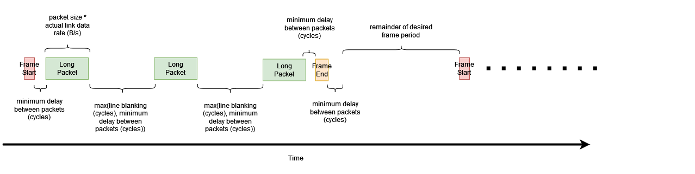
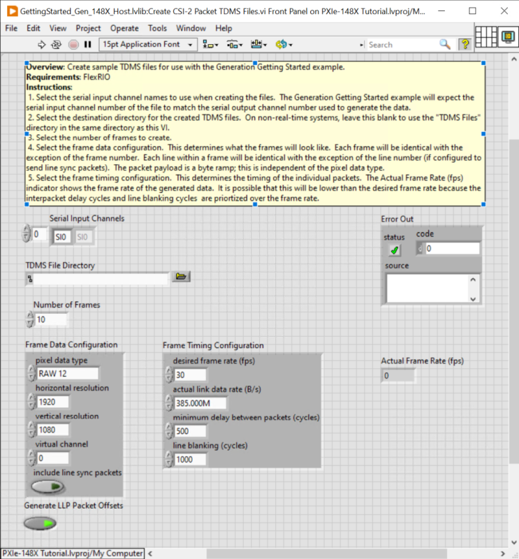

# PXIe-148X Tutorial - Create CSI-2 Packet TDMS Files
{: .no_toc }

This tutorial provides greater detail on how to generate TDMS files using the Create CSI-2 Packet TDMS Files VI for different use cases. It provides additional background details on how the VI constructs LLP Packet timestamps based on the VI's control values. 

### Table of contents
{: .no_toc }

1. TOC
{:toc}

---

## Prerequisites 
This tutorial is written for users who understand how to perform a basic generation and a basic acquisition with PXIe-148X GMSL or FPD-Link interface modules. It is recommended to complete the [PXIe-148X Getting Started Example - Basic Acquisition Tutorial](gse-acq-basic.md) and [PXIe-148X Getting Started Example - Basic Generation Tutorial](gse-gen-basic.md) before attempting this tutorial.

## Create Default TDMS File
> Note: The default scenario below demonstrates the use of this VI. This workflow will be applied with various configurations in additional scenarios below.

1. Double click the Create CSI-2 Packet TDMS Files VI in the LabVIEW project you created in the Basic Generation tutorial.

2. Run the VI to generate the TDMS file using the default settings. This creates a TDMS file for channel SO0 containing 10 frames at 1920x1080 and 30fps.

    > Note: During the first run of the VI, the TDMS File Directory control automatically populates with a value pointing to a subfolder ("TDMS Files"). This subfolder is automatically created within the project folder to store any generated TDMS files.

3. Open Windows Explorer and navigate to \<yourprojectdir\>\\Host\\Gen\\TDMS Files. The newly created TDMS file has the prefix "SI0_" to indicate it is associated with the first channel 'SO0'. Although the prefix contains 'SI' suggesting 'serial input', when used with the Generation GSE, the TDMS file actually associates with serial output channel 'SO0'.

        

## Conceptual Overview    
The TDMS file creator generates LLP packet data for use with the Generation Getting Started Example. To achieve a desired image size and frame rate, the TDMS file creator reads the front panel control values and formats ramp pattern pixel data into CSI-2 LLP packets. 
    
The TDMS file creator uses 5 LLP packet types to facilitate this: Frame Start, Frame End, Line Start, Line End, and Long Packet. If the **include line sync packets** control is false, the creator generates only Frame Start, Frame End, and Long Packets. To achieve the desired frame rate the VI sets the timestamps of the LLP packets by calculating the duration of the LLP packet, desired frame period, and interpacket delay.

- To control the duration of an LLP packet, set the **pixel data type**, **horizontal resolution**, **vertical resolution**, and **actual link data rate (B/s)**.
- To control the frame period, set the **desired frame rate (fps)** control. The frame period is 1/frame rate.
- To control the interpacket delay set the **minimum delay between packets (cycles)** and **line blanking (cycles)**.
    
> Note: You will have packet timing errors when using the generated data with the Generation Example if the interpacket delay is too low. Whether a delay is 'too low' is system specific because it depends on data path delays and serializer specifications.
    
> Note: If you set number of frames very high it can take a long time to iterate on configuration settings. It does not calculate actual fps until after the TDMS files have been generated. If you create a massive file you can run out of disk space and not get a valid data set.
    
If the interpacket delay and packet duration of the packets is greater than the desired frame period, the generated output files will not achieve the desired frame rate. The VI updates the **Actual Frame Rate (fps)** indicator after creating the TDMS files to let the user see the final frame rate achieved.

The interpacket delay in a generated TDMS file is largely goverened by the value of **minimum delay between packets (cycles)** and **line blanking (cycles)** and the rules defined below:
- Min Delay = **minimum delay between packets (cycles)**		
- Max Delay = the greater of **minimum delay between packets (cycles)** and **line blanking (cycles)**
- Long Packet following a Long Packet has Max Delay
- Line End or Frame End following a long packet has Min Delay
- Any packet following a Frame Start, Frame End, or Line Start has the Min Delay
- Line Start following a Line End has Max Delay
- Frame End following Line End has Min Delay
    
The rules above can be summarized to:

| Current Packet | Next Packet | Delay (cycles) between end of Current and start of Next Packet |
|-|-|-|
| Frame Start | Line Start | Min Delay |
| Frame Start | Long Packet | Min Delay |
| Frame End | Frame Start | Determined by desired frame rate, but must at least equal Min Delay |
| Line Start | Long Packet | Min Delay |
| Line End | Line Start | Max Delay |
| Line End | Frame End | Min Delay |
| Long Packet | Long Packet | Max Delay |
| Long Packet | Line End | Min Delay |
| Long Packet | Frame End | Min Delay |
    
    
The figure below shows what the timing of the generated LLP packets will look like with **include line sync packets** set to false.
   

The figure below shows what the timing of the generated LLP packets will look like with **include line sync packets** set to true.
   
    
    
The following scenarios will illustrate the above concepts in more detail.
        
## Determining the maximum frame rate for a given frame size    
> Note: For the purposes of this tutorial, all input control values not specified should be left as the default value.
    
1. Double click the Create CSI-2 Packet TDMS Files VI in the LabVIEW project.

2.  Set the **Number of Frames** control to 1. Setting this to 1 will let you quickly iterate over configuration settings and get feedback with the **Actual Frame Rate (fps)** indicator.
    
3. Set the **desired frame rate (fps)** to 1000. This will make the frame period much smaller than the interpacket delay and LLP packet duration.
    
4. Run the VI and look at the **Actual Frame Rate (fps)** indicator. This tells you for a given **Frame Data Configuration** and **Frame Timing Configuration** what the maximum achieveable FPS is.
    
5. Now the set the **desired frame rate (fps) to 40. This will make the frame period larger than the framme perod required for the interpacket delay and LLP packet duration.
    
6. Run the VI and look at the **Actual Frame Rate (fps)** indicator. It shows 40 fps.
    
7. Double click the TDMS File Viewer VI in the LabVIEW project.
    
    

8. Select the correct location for the **TDMS File Directory** control. By default, TDMS files generated were saved to \<yourprojectdir\>\\Host\\Gen\\TDMS Files.

    > Note: The directory browse window will not show the TDMS files located in the "TDMS Files" directory.
    
9. Run the TDMS File Viewer VI and verify you have one frame of data. You should have a Frame Start packet, followed by 1080 RAW12 packets, followed by a Frame End packet.
    
## Using line sync packets
This tutorial will enable line sync packets in the generated data and use the TDMS file viewer to verify that each RAW12 Long Packet is proceded by a Line Start packet and followed by a Line End packet.
    
> Note: For the purposes of this tutorial, all input control values not specified should be left as the default value.
    
1. Double click the Create CSI-2 Packet TDMS Files VI in the LabVIEW project.

2. Set the **Number of Frames** control to 1.
    
3. Set the **desired frame rate (fps)** to 1000.
    
4. Run the VI and look at the **Actual Frame Rate (fps)** indicator and note the FPS displayed.

5. Set the **include line sync packets** control to true.
    
6. Run the VI and look at the **Actual Frame Rate (fps)** indicator and note the FPS displayed is slightly lower than before. This is because there are more packets being sent and more minimum delays being added to each frame.
    
7. Double click the TDMS File Viewer VI in the LabVIEW project.
    
8. Select the correct location for the **TDMS File Directory** control. By default, TDMS files generated were saved to \<yourprojectdir\>\\Host\\Gen\\TDMS Files.
    
9. Run the TDMS File Viewer VI and verify that all of the RAW12 Long Packets are surrounded by Line Start and Line End packets. The display should look like the image below.
    
    
    

## Creating a TDMS File with Evenly Spaced Line Packets    
By default the Create CSI-2 Packet TDMS Files VI produces a TDMS file with all the packets in a frame tightly grouped together while still meeting the configuration requirements. This leaves the remaining time in the frame period empty. Many cameras stream data more evenly across the frame period, and the Create CSI-2 Packet TDMS Files VI can be configured to more closely approximate that behavior if desired.

This tutorial shows you how to adjust the interpacket delay to spread the line packets out evenly throughout the frame period. You will use the TDMS file Viewer to look at the packets and see how you can adjust the timing to achieve a 30 FPS TDMS file.
    
> Note: For the purposes of this tutorial, all input control values not specified should be left as the default value.
    
1. Double click the Create CSI-2 Packet TDMS Files VI in the LabVIEW project.

2. Set the **Number of Frames** control to 2. You need two frames so that you can view the entire frame period, which is measured from a Frame Start packet to the next Frame Start packet.
    
3. Set the **desired frame rate (fps)** to 30.
    
4. Run the VI and look at the **Actual Frame Rate (fps)** indicator and note the FPS displayed is 30.
    
5. Double click the TDMS File Viewer VI in the LabVIEW project.
    
6. Select the correct location for the **TDMS File Directory** control. By default, TDMS files generated were saved to \<yourprojectdir\>\\Host\\Gen\\TDMS Files.
    
7. Run the TDMS File Viewer VI and look at the timestamps of the first Frame End and second Frame Start packets on packet indexes 1081 and 1082. Note that there is a remaining frame period of 20 milliseconds. We can adjust our interpacket delay so that there is more time between each line packet and still achieve 30 FPS. Note the image below.
    
    
    
8. Set the **line blanking (cycles)** to 4650 and regenerate the TDMS file. You should see that **Actual Frame Rate (fps)** is still 30 FPS.
    
9. Run the TDMS File Viewer VI and look at the Frame End and Frame Start packets on packet indexes 1081 and 1082. Now there should be a very small remaining frame period. We have successfully moved that delay in between each of the packets. Data sets with higher interpacket delays are easier for the Generation Example to run without packet timing errors.
    
## Create CSI-2 Packet TDMS Files VI Help
    

    
    
### General
- **Serial Input Channels** - Array of strings representing the channels for which you will generate TDMS files. Generated TDMS files have the prefix “SIx_” to indicate it is associated with a channel ‘SOx’. Although the prefix contains ‘SI’ suggesting ‘serial input’, when used with the Generation GSE, the TDMS file actually associates a specific serial output channel e.g. ‘SO0’.
- **TDMS File Directory** - Path to the directory used to load TDMS data files. 
    > If left blank the TDMS File Directory is automatically populated with a path to a subfolder ("TDMS Files") within the getting started example root directory. TDMS data files include files for LLP packet data, I2C timestamps, and GPIO timestamps.
- **Number of Frames** - The number of frames to generate.
- **Actual Frame Rate (fps)** - The calculated frame rate based on **Frame Data Configuration** and **Frame Timing Configuration** control values. This value may differ from the **desired frame rate (fps)** depending on other control values.
- **Error Out** - Displays any error that occurred when running the VI.
    
### Frame Data Configuration
- **pixel data type** - Data type of the LLP packet payload for long packets.
    > Supported Options: YUV420 8-bit, YUV420 10-bit, Legacy YUV420 8-bit, YUV420 8-bit Chroma Shifted, YUV420 10-bit Chroma Shifted, YUV422 8-bit, YUV422 10-bit, RGB565, RGB666, RGB888, RAW 8, RAW 10, RAW 12, RAW 14, RAW 16.
- **horizontal resolution** - The number of pixels from left to right of a generated frame. Each long packet generated will have a payload containing the number of pixels defined by this value.
- **vertical resolution** - The number of pixels from top to bottom of a generated frame. Each frame generated will have a number of long packets equal to this value.
- **virtual channel** - Number representing a Virtual Channel Identifier.
    > Virtual channel identifiers designate separate logical channels for data flows interleaved in the data path.
- **include line sync packets** - Determines whether each generated Long Packet will be preceded by a Line Start Packet and followed by a Line End packet.

### Frame Timing Configuration
- **desired frame rate (fps)** - Target frame rate for generated TDMS data.
- **actual link data rate (B/s)** - The maximum link rate of the serializer. Refer to the table below.
    
    | Serializer | Theoretical Max | Practical Max |
    |-|-|-|
    | DS90UB953 | 400MB/s | 385 MB/s |
    | MAX9295A  | 750MB/s | 600 MB/s |
    
    > The practical maxes were empirically determined. You may find for your application the values can vary higher or lower.
    > Refer to [Automotive Camera Module Variants Table](reference/hardware/automotive-camera-module-variants.md) to associate a serializer with a specific interface device module.
- **minimum delay between packets (cycles)** - The minimum number of cycles of delay between LLP packets. Refer to the [Conceptual Overview](#conceptual-overview) for additional detail.
- **line blanking (cycles)** - The minimum number of cycles of delay between lines in a frame.  Refer to the [Conceptual Overview](#conceptual-overview) for additional detail.
    
## Related Documents
- [PXIe-148X Getting Started Example - Basic Generation Tutorial](./gse-gen-basic.md)
- [PXIe-148X Getting Started Example - Common Generation Tutorials](./gse-gen-common.md)
- [PXIe-148X Getting Started Example - Generation Help](../../reference/gettingstartedexample/gse-gen-help.md) 
  
