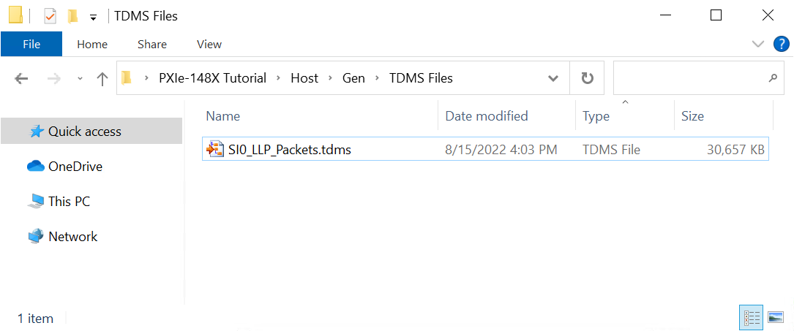
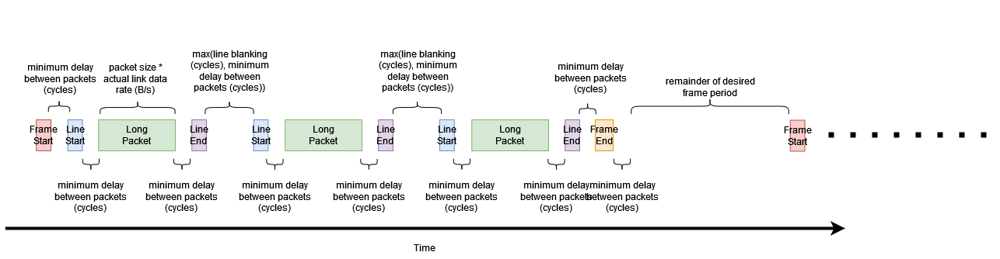

# PXIe-148X Tutorial - Create CSI-2 Packet TDMS Files
{: .no_toc }

This tutorial provides greater detail on how to generate TDMS files using the Create CSI-2 Packet TDMS Files VI for different use cases. It provides additional background details on how the VI constructs LLP Packet timestamps based on the VI's control values. 

### Table of contents
{: .no_toc }

1. TOC
{:toc}

---

## Prerequisites 
This tutorial is written for users who understand how to perform a basic generation and a basic acquisition with PXIe-148X GMSL or FPD-Link interface modules. It is recommended to complete the [PXIe-148X Getting Started Example - Basic Acquisition Tutorial](gse-acq-basic.md) and [PXIe-148X Getting Started Example - Basic Generation Tutorial](gse-gen-basic.md) before attempting this tutorial.

## Create Default TDMS File
> Note: The default scenario below demonstrates the use of this VI. This workflow will be applied with various configurations in additional scenarios below.

1. Double click the Create CSI-2 Packet TDMS Files VI in the LabVIEW project you created in the Basic Generation tutorial.

2. For this scenario the default settings are used to generate a TDMS file for channel SO0 containing 10 frames at 1920x1080 and 30fps .

    > Note: During the first run of the VI, the **TDMS File Directory** control automatically populates with a value pointing to a subfolder (\"TDMS Files\"). This subfolder is automatically created within the project folder to store any generated TDMS files.

3.  Run the VI to generate the TDMS file.

4.  Open Windows Explorer and navigate to \<yourprojectdir\>\\Host\\Gen\\TDMS Files. The newly created TDMS file has the prefix "SI0_" to indicate it is associated with the first channel 'SO0'. Although the prefix contains 'SI' suggesting 'serial input', when used with the Generation GSE, the TDMS file actually associates with serial output channel 'SO0'.

        

## Conceptual Overview
TODO: Give description of what the LLP packet data looks like (and show diagram). Give explanation of how the various controls can affect the timing relationship of the generated data.
  
   
    
    
     

## Determining the maximum frame rate for a given frame size
TODO: Talk about the practical implications of the conceptual overview. I.E. setting desired FPS really high or making other timing constraints loose to find the ideal configuration settings. The constraints work in different ways, they applied in a priority order but the strictest limitation will determine your actual FPS.

## Using line sync packets
### Controlling timing with line start/end packets
### Controlling timing without line start/end packets

## Evenly spacing long packets to fill the entire time window for a frame

## Other Considerations and Tips
### Accidentally creating impossible configurations (packet timing errors)
### Generating overly large files
    
## TBD - DO WE NEED THESE?
### What's some realistic numbers I can use for 1486, 1487, 1 channel? 8 channels?
### What's the most data I can saturate the link with?
    
## Create CSI-2 Packet TDMS Files VI Help
    

    
    
### General
- **Serial Input Channels** - TODO
- **TDMS File Directory** - Path to the directory used to load TDMS data files. 
    > If left blank the TDMS File Directory is automatically populated with a path to a subfolder ("TDMS Files") within the getting started example root directory. TDMS data files include files for LLP packet data, I2C timestamps, and GPIO timestamps.
- **Number of Frames** - TODO
- **Actual Frame Rate (fps)** - TODO
- **Error Out** - Displays any error that occurred when running the VI.
    
### Frame Data Configuration
- **pixel data type** - TODO
- **horizontal resolution** - TODO
- **vertical resolution** - TODO
- **virtual channel** - TODO
- **include line sync packets** - TODO

### Frame Timing Configuration
- **desired frame rate (fps)** - TODO
- **actual link data rate (B/s)** - TODO
- **minimum delay between packets (cycles)** - TODO
- **line blanking (cycles)** - TODO

## Related Documents
- [PXIe-148X Getting Started Example - Basic Generation Tutorial](./gse-gen-basic.md)
- [PXIe-148X Getting Started Example - Common Generation Tutorials](./gse-gen-common.md)
- [PXIe-148X Getting Started Example - Generation Help](../../reference/gettingstartedexample/gse-gen-help.md) 
  
