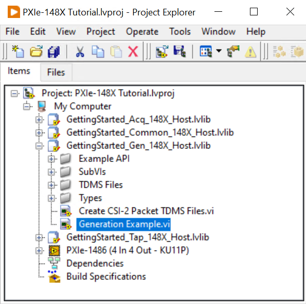

# PXIe-148X Getting Started Example - Basic Generation Tutorial
{: .no_toc }

** IN WORK - DOCUMENTATION IS INCOMPLETE AND IN ACTIVE DEVELOPMENT **

This tutorial will teach you the steps needed to configure an acquisition using a PXIe-148X module with a Leopard Imaging IMX490 camera and familiarize you with the basic functionality provided by the Acquisition Getting Started Example.

### Table of contents
{: .no_toc }

1. TOC
{:toc}

---

## Prerequisites

Review and complete all setup from the [PXIe-1486 Getting Started Guide](https://www.ni.com/docs/en-US/bundle/pxie-1486-getting-started/) or [PXIe-1487 Getting Started Guide](https://www.ni.com/docs/en-US/bundle/pxie-1487-getting-started/).

Basic knowledge of LabVIEW and LabVIEW FPGA concepts. 

A supported interface module on a PXI system running Windows.

| **Interface Module**   |
|------------------------|
| PXIe-1486 (8 Out)      |
| PXIe-1486 (4 In 4 Out) |
| PXIe-1487 (8 Out)      |
| PXIe-1487 (4 In 4 Out) |

## Initial Hardware Setup

1. Complete installation of hardware as described in the Getting Started Guide linked above.
2. No physical connections to other modules or devices are required to complete the basic tutorial.

## Initial Software Setup

1.  First complete installation of software specified in the Getting Started Guide linked above.
2.  Use the NI Example Finder to create a default project for your specific interface module.
    - Open LabVIEW and click **Help -> Find Examples...**
    
    
    - In the NI Example Finder dialog, double-click **Hardware Input and Output -> FlexRIO -> Integrated IO -> Getting Started -> Getting Started FlexRIO Integrated IO.vi**
    
    - In the FlexRIO with Integrated IO Project Creator dialog set the **Project Name** to PXIe-148X Tutorial and make the **FlexRIO Integrated IO** selection for the desired PXIe-148X interface module then click **OK**.
    

## Create TDMS Files for Generation
> Note: For the purposes of this tutorial, all input control values not specified should be left as the default value.

1. Double click the Create CSI-2 Packet TDMS Files VI in the LabVIEW project.

    

    > The opened front panel of the Generation Getting Started Example is similar to the figure below.

    

2.  Review the instructions on the VI front panel. For this tutorial the default settings will be used to generate a TDMS file for channel SO0 containing 10 frames at 1920x1080 and 30fps .

    > Note: During the first run of the VI, the **TDMS File Directory** control will be automatically populated with a value pointing to a subfolder (\"TDMS Files\"). This subfolder is automatically created within the project folder to store any generated TDMS files.

3.  Run the VI to generate the TDMS file.

4.  Open Windows Explorer and navigate to \<yourprojectdir\>\\Host\\Gen\\TDMS Files. The newly created TDMS file has the prefix "SI0_" to indicate it is associated with the first channel 'SO0'. Although the prefix contains 'SI' suggesting 'serial input', when used with the Generation GSE the TDMS file will actually be associated with serial output channel 'SO0'.

    

5. The newly created TDMS file will be used in the following tutorial to perform a simple generation.

## Performing a Simple Generation
> Note: For the purposes of this tutorial, all input control values not specified should be left as the default value.

1. Double click the Generation Example VI in the LabVIEW project.

    

    > The opened front panel of the Generation Getting Started Example is similar to the figure below.

    

2.  Select the **Resource** tab and make the following modifications.
    - Select the **RIO Device** from the dropdown menu that corresponds to your interface module.
    - Set the **Bitfile Path** to the bitfile that corresponds to your interface module. The default shipping bitfile is in the 'FPGA Bitfiles' subfolder located in the project folder (created at the Project Root location specified in Project Creator):

    | **Interface Module**   | **Bitfile**                                          |
    |------------------------|------------------------------------------------------|
    | PXIe-1486 (8 Out)       | FPGA Bitfiles\\PXIe_1486_8\_Out.lvbitx              |
    | PXIe-1486 (4 In 4 Out) | FPGA Bitfiles\\PXIe_1486_4\_In_4\_Out_Gen.lvbitx |
    | PXIe-1487 (8 Out)       | FPGA Bitfiles\\PXIe_1487_8\_Out.lvbitx              |
    | PXIe-1487 (4 In 4 Out) | FPGA Bitfiles\\PXIe_1487_4\_In_4\_Out_Gen.lvbitx |

    > The values on the **Resource** tab of **Configuration Settings** are now similar to the figure below.

    

3.  Run the VI to perform a generation using the TDMS file created in the previous tutorial.

4.  The generation GSE example will first load the bitfile and then buffer available data from disk to onboard DRAM. After buffering, the **Waiting for Serializer Setup** indicator will enable to indicate the module is ready for generation.

    

5.  Click the **Serializer Setup Complete** control button to start generation. Generated images display automatically in the First Display Channel tab.

    

6.  The VI will stop automatically when all data from the TDMS file has been generated.

## Performing a Simple Generation with GPIO Logging

> Note: The Performing a Simple Generation with GPIO Logging tutorial assumes that all input parameters are still configured as specified in the Performing a Simple Generation tutorial.

1.  Select the **Resource** tab and make the following modifications.
    - Enable **Log GPIO to Disk**.

    > Note: During the first run of the VI in the Performing a Simple Generation tutorial, the **TDMS File Directory** control was automatically populated with a value pointing to a subfolder (\"TDMS Files\"). This subfolder was automatically created within the project folder to load any existing TDMS files.

    > The values on the **Resource** tab of **Configuration Settings** are now similar to the figure below.
    
    

2.  Select the **GPIO** tab and make the following modifications.
    - Add a GPIO line to the **GPIO to Display** array with the GPIO Bank value set to **Ser0 GPIO** and the GPIO Number set to 0. Setting these values enables display of GPIO traffic for the GPIO 0 line on the SI0 channel connected to the camera.

    > The values on the **GPIO** tab of **Configuration Settings** are now similar to the figure below.

    

3.  Run the VI, wait for the **Waiting for Serializer Setup** indicator to enable, and  click the **Serializer Setup Complete** control button to start the generation. Results are displayed on the various tabs in the **Data Output** indicator.

4.  GPIO timestamp data is plotted in the **GPIO Timestamps** tab.

    

    > Note: The module interface does not toggle GPIOs by default. Any change shown in the figure above reflects GPIO level reset when the example VI is first run.

## Related Documents
- [PXIe-148X Getting Started Example - Common Generation Tutorials](./gse-gen-common.md)
- [PXIe-148X Getting Started Example - Generation Help](../../reference/gettingstartedexample/gse-gen-help.md)
- [PXIe-148X Getting Started Example - Basic Acquisition Tutorial](./gse-acq-basic.md)
- [PXIe-148X Getting Started Example - Basic Tap Tutorial](./gse-tap-basic.md)
    
