# PXIe-148X Getting Started Example - Common Generation Tutorials

This document covers a range of common scenarios using the PXIe-148X Generation Getting Started Example (GSE) to help you understand LLP generation, I2C and GPIO timestamping, and common configuration options.

> Note: This document references the example included with the NI-FlexRIO 22Q3 driver. Examples included in newer releases of the driver should be appliable.

### Table of contents
{: .no_toc }

1. TOC
{:toc}

---

## Prerequisites
This tutorial is written for users who understand how to perform a basic generation and a basic acquisition with PXIe-148X GMSL or FPD-Link interface modules. It is recommended to complete the [PXIe-148X Getting Started Example - Basic Acquisition Tutorial](gse-acq-basic.md) and [PXIe-148X Getting Started Example - Basic Generation Tutorial](gse-gen-basic.md) before attempting this tutorial.

> Note: The tutorials in this document assume the use of a PXIe-148X GMSL or FPD-Link Generation Interface module and an Acquisition Interface module connected to SI0 and SO0 of the respective modules. A Leopard Imaging IMX490 camera is also used to acquire packet data and replay it through a generation interface module. See PXIe-148X Getting Started Example - Basic Acquisition Tutorial and Basic Generation Tutorial for specific setup if needed.

## Generation and Acquisition Topics
This tutorial expects that SO0 of a generation module and SI0 of an acquisition module are cabled together. This tutorial will use one generation LabVIEW project and one acquisition LabVIEW project to demonstrate the generation capabilities of the generation module.

> Note: For the purposes of this tutorial, all input control values not specified should be left as the default value.

### Performing a Simple Generation and Acquisition
1. Double click the Create CSI-2 Packet TDMS Files VI in the generation LabVIEW project and create a TDMS file for SI0. Leave all values default.

> Note: Refer to the [PXIe-148X Getting Started Example - Basic Generation Tutorial](gse-gen-basic.md) to create a TDMS file for Serial Output channel 0.

2. Double click the Generation Example VI in the LabVIEW project.

3. Set the following controls on the Generation Example GSE VI and leave all other values at their defaults.
    > Note: VI controls and indicators can be reset to default values by clicking on the **Edit** menu and selecting the **Reinitialize Values to Default** option.

    | Tab | Control | Value |
    |---|---|---|
    | Resource | RIO Device | [System Specific] |
    | Resource | Bitfile Path | [Refer to Bitfile Path in the PXIe-148X Generation GSE Help](../../reference/gettingstartedexample/gse-gen-help.md#table-of-pxie-148x-generation-bitfiles) |
    | Resource | TDMS File Directory| A directory path to TDMS files containing LLP Packet data for serial output channels (e.g. SI0_LLP_Packets.tdms) |
    
    > Note: The **TDMS File Directory** is a folder selection and the browse dialog shows folders only, not file names. 
    >
    > Use the default **TDMS File Directory** value if generating from a TDMS file created with the Create CSI-2 Packet TDMS Files utility's default settings. See the [PXIe-148X Getting Started Example - Basic Generation Tutorial](gse-gen-basic.md#create-tdms-files-for-generation) for details on creating TDMS files.

4. Double click the Acquisition Example VI in the Acquisition LabVIEW project.

5. Set the following controls on the Acquisition Example GSE VI and leave all other values at their defaults.
    > Note: VI controls and indicators can be reset to default values by clicking on the **Edit** menu and selecting the **Reinitialize Values to Default** option.

    | Tab            | Control                 | Value                                                                                                                                                               |
    |----------------|-------------------------|---------------------------------------------------------------------------------------------------------------------------------------------------------------------|
    | Resource       | RIO Device              | [System Specific]                                                                                                                                                   |
    | Resource       | Bitfile Path            | [Refer to Bitfile Path in the PXIe-148X Acquisition GSE Help](../../reference/gettingstartedexample/gse-acq-help.md#table-of-pxie-148x-acquisition-bitfiles)        |
    | Serial Channel | Configuration Script    | [Refer to Configuration Script in the PXIe-148X Acquisition GSE Help](../../reference/gettingstartedexample/gse-acq-help.md#table-of-pxie-148x-acquisition-scripts) |

6. Run the Generation Example VI and wait for the Waiting for Serializer Setup indicator to illuminate

7. Run the Acquisition Example VI.

8. After the Acquisition Example VI indicates acquisition has started, click Serializer Setup Complete on the Generation VI before the Acquisition VI stops.

9. Select the **First Display Channel** tab on the Acquisition Example and on the Generation Example and verify that images from the generated TDMS file are displayed on these tabs. The images should look identical.

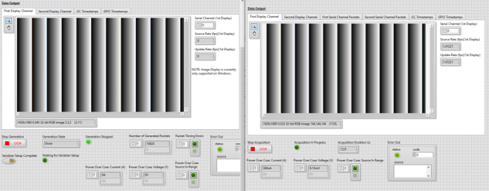

### Generating and Displaying I2C Timestamps
This tutorial shows how to acquire and view I2C timestamps on the PXIe-148X interface module. The Generation Example VI will be used to run a script to create I2C traffic.

> Note: Timestamps are relative to a time immediately after the FPGA bitfile is downloaded and run, not the start of the acquisition. This allows capturing I2C and GPIO timestamps during configuration before the acquisition starts.

1. Set the following controls on the Acquisition Example GSE VI and leave all other values at their defaults.
    > Note: VI controls and indicators can be reset to default values by clicking on the **Edit** menu and selecting the **Reinitialize Values to Default** option.

    | Tab            | Setting                 | Value                                                                                                                                                               |
    |----------------|-------------------------|---------------------------------------------------------------------------------------------------------------------------------------------------------------------|
    | Resource       | RIO Device              | [System Specific]                                                                                                                                                   |
    | Resource       | Bitfile Path            | [Refer to Bitfile Path in the PXIe-148X Acquisition GSE Help](../../reference/gettingstartedexample/gse-acq-help.md#table-of-pxie-148x-acquisition-bitfiles)        |
    | Resource       | Display Acquired Images | Disabled                                                                                                                                                            |
    | Resource       | Log I2C to Disk         | Enabled                                                                                                                                                             |

2.  Select the **I2C** tab and make the following modifications.

    > The I2C tab only has one control, the I2C **timestamp filter**. This filter contains an array of timestamp IDs. **User24** represents the I2C traffic on serial channel 0 (SI0), **User25** represents the I2C traffic on serial channel 1 (SI1), and so on.
    - Set the **timestamp filter** array to contain only the **User24** timestamp ID. This will let you see the I2C traffic on SI0. If you run the VI with a configuration script selected, you will see configuration traffic in the I2C Data Output tab after the VI has stopped.

    
	
3. Set the following controls on the Generation Example GSE VI and leave all other values at their defaults.
    > Note: VI controls and indicators can be reset to default values by clicking on the **Edit** menu and selecting the **Reinitialize Values to Default** option.

    | Tab            | Setting                 | Value                                                                                                                                                               |
    |----------------|-------------------------|---------------------------------------------------------------------------------------------------------------------------------------------------------------------|
    | Resource       | RIO Device              | [System Specific]                                                                                                                                                   |
    | Resource       | Bitfile Path            | [Refer to Bitfile Path in the PXIe-148X Generation GSE Help](../../reference/gettingstartedexample/gse-gen-help.md#table-of-pxie-148x-generation-bitfiles)        |
    | Resource       | Display Generated Images | Disabled                                                                                                                                                            |
    | Resource       | Log I2C to Disk         | Enabled                                                                                                                                                             |
    | Serial Channel | Configuration Script    | [Refer to Configuration Script in the PXIe-148X Acquisition GSE Help](../../reference/gettingstartedexample/gse-acq-help.md#table-of-pxie-148x-acquisition-scripts) |
    
4.  Select the **I2C** tab on the Generation VI and make the following modifications.

    > The I2C tab only has one control, the I2C **timestamp filter**. This filter contains an array of timestamp IDs. **User24** represents the I2C traffic on serial channel 0 (SI0), **User25** represents the I2C traffic on serial channel 1 (SI1), and so on.
    - Set the **timestamp filter** array to contain only the **User24** timestamp ID. This will let you see the I2C traffic on SI0. If you run the VI with a configuration script selected, you will see configuration traffic in the I2C Data Output tab after the VI has stopped.

    

5.  Run the Acquisition VI. 

6.  Run the Generation VI.

7.  Select the **I2C Timestamps** tab on the Generation VI to view I2C timestamp data.
    - View the displayed I2C timestamp data in the **I2C Timestamps** table. The **I2C Timestamps** table displays I2C timestamp information for all I2C traffic. I2C timestamps begin logging immediately after the FPGA bitfile is downloaded and include timestamp data prior to the start of the LLP packet data acquisition (i.e. I2C traffic from the configuration script).

        > Note: To display I2C timestamp data, **Log I2C to Disk** must be enabled and desired timestamp IDs must be added to the **timestamp filter** array. The I2C timestamp data displayed is read from the User_Timestamps.tdms file and filtered to display only timestamp IDs included in the timestamp filer array. The **I2C Timestamps** display is updated after the acquisitions completes.
   
8. Select the **I2C Timestamps** tab on the Acquisition VI to view I2C timestamp data.

    

## Playing Back Previously Acquired Data
1. Refer to the [PXIe-148X Getting Started Example - Common Acquisition Tutorial](gse-acq-common.md#acquiring-and-filtering-llp-packets)to acquire LLP packets from a camera and store them in a TDMS file.
 
2. Double click the Generation Example VI in the generation LabVIEW project.

3. Set the following controls on the Generation Example GSE VI and leave all other values at their defaults.
    > Note: VI controls and indicators can be reset to default values by clicking on the **Edit** menu and selecting the **Reinitialize Values to Default** option.

    | Tab | Control | Value |
    |---|---|---|
    | Resource | RIO Device | [System Specific] |
    | Resource | Bitfile Path | [Refer to Bitfile Path in the PXIe-148X Generation GSE Help](../../reference/gettingstartedexample/gse-gen-help.md#table-of-pxie-148x-generation-bitfiles) |
    | Resource | TDMS File Directory| A directory path to TDMS files containing LLP Packet data for serial output channels (e.g. SI0_LLP_Packets.tdms) |
    
    > Note: The **TDMS File Directory** is a folder selection and the browse dialog shows folders only, not file names. 
    >

4. Run the Generation Example VI.

5. Select the **First Display Channel** tab on the Generation Example and verify that images from the previously acquired data are displayed on this tab. 

## Setting FPGA Display Parameters

This tutorial shows you how to configure the **FPGA Display Parameters** to change the images displayed during generation.

1. Set the following controls on the Generation Example GSE VI and leave all other values at their defaults.
    > Note: VI controls and indicators can be reset to default values by clicking on the **Edit** menu and selecting the **Reinitialize Values to Default** option.

    | Tab | Control | Value |
    |---|---|---|
    | Resource | RIO Device | [System Specific] |
    | Resource | Bitfile Path | [Refer to Bitfile Path in the PXIe-148X Generation GSE Help](../../reference/gettingstartedexample/gse-gen-help.md#table-of-pxie-148x-generation-bitfiles) |
    | Resource | TDMS File Directory| A directory path to TDMS files containing LLP Packet data for serial output channels (e.g. SI0_LLP_Packets.tdms) |
    
    > Note: The **TDMS File Directory** is a folder selection and the browse dialog shows folders only, not file names. 
    >
    > Use the default **TDMS File Directory** value if generating from a TDMS file created with the Create CSI-2 Packet TDMS Files utility's default settings. See the [PXIe-148X Getting Started Example - Basic Generation Tutorial](gse-gen-basic.md#create-tdms-files-for-generation) for details on creating TDMS files.

### Displaying Generated Images
The logic for FPGA display parameters is shared for all PXIe-148X getting started examples. Therefore, the acquisition tutorial for this topic is used with a few minor differences.

1. Complete the steps in [PXIe-148X Getting Started Example - Common Acquisition Tutorials](gse-acq-common.md#displaying-acquired-images) with the following differences.
    - Replace all references to SI0 with SO0.
    - When running the Generation Example VI, wait for the **Waiting for Serializer Setup** indicator to illuminate then click **Serializer Setup Complete**.

### Reducing System Bandwidth Usage
The logic for FPGA display parameters is shared for all PXIe-148X getting started examples. Therefore, the acquisition tutorial for this topic is used with a few minor differences.

1. Complete the steps in [PXIe-148X Getting Started Example - Common Acquisition Tutorials](gse-acq-common.md#reducing-system-bandwidth-usage) with the following differences.
    - When running the Generation Example VI, wait for the **Waiting for Serializer Setup** indicator to illuminate then click **Serializer Setup Complete**.

## Setting RAW Display Parameters

This tutorial shows you how to configure the **RAW Display Parameters** to change the interpretation of images being displayed during generation. The logic for FPGA display parameters is shared for all PXIe-148X getting started examples. Therefore, the acquisition tutorial for this topic is used with a few minor differences.

> Note: If using a TDMS file created with the Create CSI-2 Packet TDMS Files utility, the impact of the RAW display parameter settings will differ from a TDMS file containing image data acquired from a camera.

1. Set the following controls on the Generation Example GSE VI and leave all other values at their defaults.
    > Note: VI controls and indicators can be reset to default values by clicking on the **Edit** menu and selecting the **Reinitialize Values to Default** option.

    | Tab | Control | Value |
    |---|---|---|
    | Resource | RIO Device | [System Specific] |
    | Resource | Bitfile Path | [Refer to Bitfile Path in the PXIe-148X Generation GSE Help](../../reference/gettingstartedexample/gse-gen-help.md#table-of-pxie-148x-generation-bitfiles) |
    | Resource | TDMS File Directory| A directory path to TDMS files containing LLP Packet data for serial output channels (e.g. SI0_LLP_Packets.tdms) |

    > Note: The **TDMS File Directory** is a folder selection and the browse dialog shows folders only, not file names. 
    >
    > Use the default **TDMS File Directory** value if generating from a TDMS file created with the Create CSI-2 Packet TDMS Files utility's default settings. See the [PXIe-148X Getting Started Example - Basic Generation Tutorial](gse-gen-basic.md#create-tdms-files-for-generation) for details on creating TDMS files.

2. Complete the steps in [PXIe-148X Getting Started Example - Common Acquisition Tutorials](gse-acq-common.md#setting-raw-display-parameters) with the following differences.
    - Replace all references to SI0 with SO0.
    - When running the Generation Example VI, wait for the **Waiting for Serializer Setup** indicator to illuminate then click **Serializer Setup Complete**.

## Setting Serial Channel Configurations

This tutorial shows you how to configure the **Serial Channel** tab to generate and display images on multiple serial output channels and set a start trigger delay.

### Creating TDMS Files to Generate Multiple Images

1. Open the Create CSI-2 Packet TDMS Files utility in the LabVIEW project.

2. Run the VI with all default settings to generate a TDMS file for channel SI0 containing 10 frames at 1920x1080 resolution.

3. Make the following modifications on the Create CSI-2 Packet TDMS Files utility front panel to generate a second TDMS file with image data differing from the first TDMS file created in the previous step.
    - Set the value at index 0 of the **Serial Input Channels** array to SI1.
    - Make the following modifications to the **Frame Data Configuration** control.
        - Set the **horizontal resolution** control value to 2880.
        - Set the **vertical resolution** control value to 1280.
    
    > The Create TDMS Files utility settings are now similar to the image below.

    

4.  Run the VI to generate a TDMS file for channel SI1 containing 10 frames at 2880x1280 resolution.

### Generating and Displaying Multiple Images

5. Set the following controls on the Generation Example GSE VI and leave all other values at their defaults.
    > Note: VI controls and indicators can be reset to default values by clicking on the **Edit** menu and selecting the **Reinitialize Values to Default** option.

    | Tab | Control | Value |
    |---|---|---|
    | Resource | RIO Device | [System Specific] |
    | Resource | Bitfile Path | [Refer to Bitfile Path in the PXIe-148X Generation GSE Help](../../reference/gettingstartedexample/gse-gen-help.md#table-of-pxie-148x-generation-bitfiles) |

6. Select the **Serial Channel** tab and make the following modifications.
    - Select index 0 of the **Channel Configurations** array and make the following modifications.
        - Select **Grayscale** on the **Interpretation** control in the **RAW Display Parameters** cluster.
    - Select index 1 of the **Channel Configurations** array and make the following modifications.
        - Set the **Serial Channel** control value to SO1.
        - Select **Grayscale** on the **Interpretation** control in the **RAW Display Parameters** cluster.
   
   > The settings on the **Serial Channel** tab are now similar to the image below.
   
   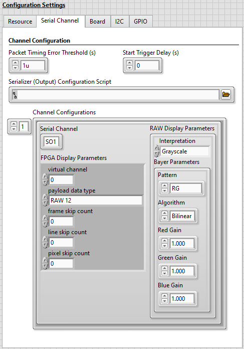

7. Run the VI, wait for the **Waiting for Serializer Setup** indicator to illuminate, and click the **Serializer Setup Complete** control button to start the generation.
    > Once the generation completes, notice the **Number of Generated Packets** indicator array shows a value of 10820 at index 0 and 12820 at index 1, which equals the number of packets per frame (vertical resolution) times the number of frames generated for each channel. The indices in the **Number of Generated Packets** array correspond to the indices in the **Channel Configurations** array.

    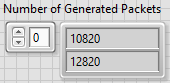

8. Click the **First Display Channel** tab to view the last frame displayed for SO0.
    > Note that the image resolution matches the 1920x1080 resolution of the TDMS file created for SI0.

    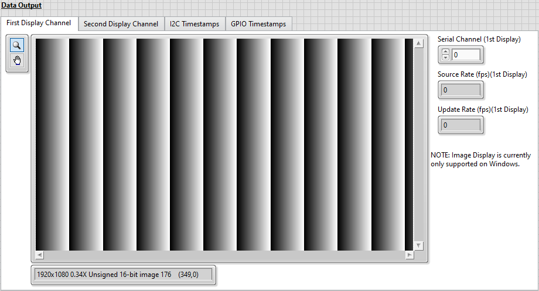

9. Click the **Second Display Channel** tab to view the last frame displayed for SO1.
    > Note that the image resolution matches the 2880x1280 resolution of the TDMS file created for SI1.

    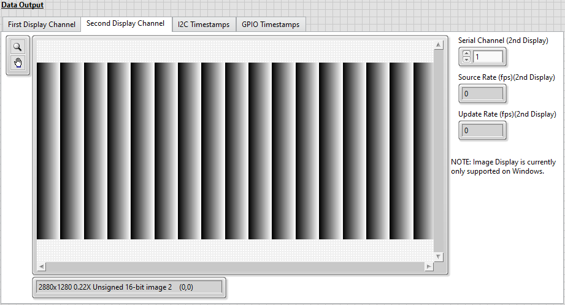

### Setting a Start Trigger Delay

This section of the tutorial shows you how to delay the generation start. Image data acquired using the PXIe-148X Acquisition getting started example often has several seconds of delay before the first packet is acquired while the camera is configured. The PXIe-148X Generation getting started example sets a packet timing offset value to the negative of the first packet timestamp in the TDMS file to prevent any unwanted delay in the start of generation. If a delay is desired the **Start Trigger Delay (s)** control is used. Refer to the **Start Trigger Delay (s)** description in the [PXIe-148X Generation GSE Help](../../reference/gettingstartedexample/gse-gen-help.md#serial-channel-tab) for additional details.

10. Select the **Serial Channel** tab and set the **Start Trigger Delay (s)** control value to 2.
   
   > The settings on the **Serial Channel** tab are now similar to the image below.
   
   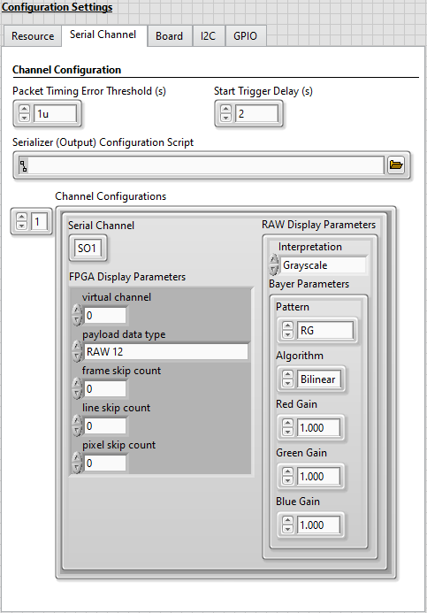

11. Run the VI, wait for the **Waiting for Serializer Setup** indicator to illuminate, and click the **Serializer Setup Complete** control button to start the generation. 
    > The start of packet transmission is delayed and thus the image display is also delayed. Notice that there is now a 2 second delay before images are generated and displayed after clicking the **Serializer Setup Complete** button. 

## Using the General Purpose Input/Output (GPIO) Lines

This tutorial shows you how to configure routing of GPIO lines between GPIO banks as well as manually reading and writing to the GPIO banks on the PXIe-148X interface module. This tutorial modifies GPIO line values while the generation is running, logs the GPIO timestamps to disk and displays digital waveforms of the GPIO lines.

> Note: Timestamps are relative to a time immediately after the FPGA bitfile is downloaded and run, not the start of the generation. This allows capturing I2C and GPIO timestamps during configuration before the generation starts.

1. Set the following controls on the Generation Example GSE VI and leave all other values at their defaults.
    > Note: VI controls and indicators can be reset to default values by clicking on the **Edit** menu and selecting the **Reinitialize Values to Default** option.

    | Tab | Setting | Value |
    |---|---|---|
    | Resource | RIO Device | [System Specific] |
    | Resource | Bitfile Path | [Refer to Bitfile Path in the PXIe-148X Generation GSE Help](../../reference/gettingstartedexample/gse-gen-help.md#table-of-pxie-148x-generation-bitfiles) |
    | Resource | Display Generated Images | Disabled |
    | Resource | Log GPIO to Disk | Enabled |

### Creating a TDMS File for the GPIO Tutorial

1. Open the Create CSI-2 Packet TDMS Files utility in the LabVIEW project.

2. Make the following modifications on the Create CSI-2 Packet TDMS Files utility front panel.
    - Set the **Number of Frames** control to 60
    - Update the **Frame Data Configuration** cluster with the following settings.
        - Set the **horizontal resolution** control value to 640.
        - Set the **vertical resolution** control value to 480.
    - In the **Frame Timing Configuration** cluster, set the **desired frame rate (fps)** control to 1.
    
    > The Create TDMS Files utility settings are now similar to the image below.

    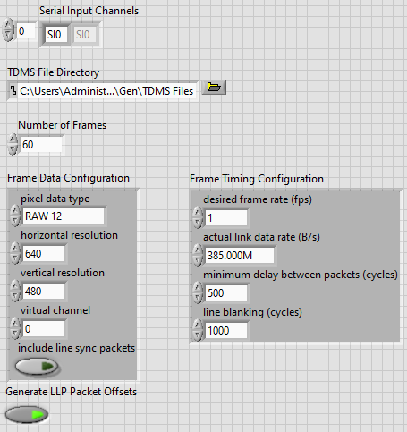

3. Run the VI to generate a TDMS file for channel SI0 containing 60 frames at 640x480 resolution.
    > The frame rate of 1 frame per second will cause the generation to run for 1 minute, which will allow enough time to manually read and write to GPIO during the generation.

### Manually Reading and Writing to GPIO

This tutorial shows you how to perform manual reads and writes to GPIO during generation and display digital waveforms for the resulting GPIO timestamp data.
> Note: The [Creating a TDMS File for the GPIO Tutorial](#creating-a-tdms-file-for-the-gpio-tutorial) section should be run prior to running the steps in this tutorial.

1. Select the **GPIO** tab and make the following modifications.
    - Update the **GPIO to Display** array with the following settings.
        - At index 0 select **Ser0 GPIO** in the **GPIO Bank** control and set the **GPIO Number** to 0. 

        > Setting these values enables display of GPIO traffic for GPIO line 0 on the SO0 channel. Optionally add any additional GPIO lines to display.
        >
        > The **GPIO to Display** control specifies GPIO lines to display on the GPIO Timestamps Waveform after the generation completes. Timestamps for GPIO lines not included in the **GPIO to Display** array are logged, but not displayed.

    - Select **SO0 Serializer** from the **GPIO Bank Select** drop down menu.
    
        > The **GPIO Bank Select** control specifies the GPIO bank used for the **GPIO Bank Output**, **GPIO Bank Output Enable** and **GPIO Bank Read** controls during the generation. The **GPIO Bank Select** selection may be changed at runtime.

    - In the **GPIO Bank Output Enable** cluster, enable the **GPIO 0** control.
        > The **GPIO Bank Output Enable** controls are used as write enables for manual GPIO writes to override the defined GPIO routing. In this case we are choosing to write to line 0 of the GPIO selected on the **GPIO Bank Select** control and leave all other lines in the bank unchanged.

   > The settings on the **GPIO** tab are now similar to the image below.
   
   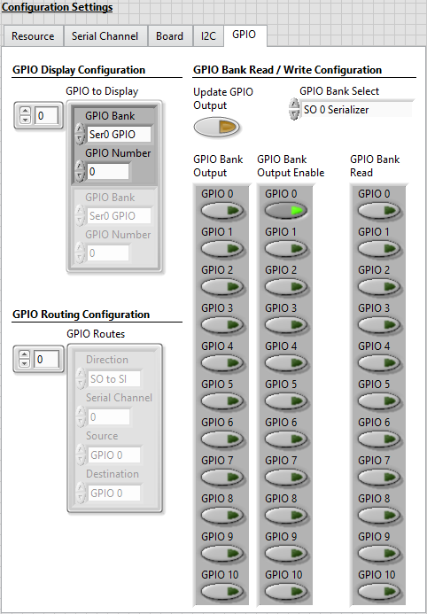

2. Run the VI, wait for the **Waiting for Serializer Setup** indicator to illuminate, and click the **Serializer Setup Complete** control button to start the generation.

3. Click **Update GPIO Output** to write a false value to line 0 on the SO 0 Serializer GPIO bank.
    > Notice that the **GPIO 0** Boolean indicator in the **GPIO Bank Read** cluster is not illuminated (false).

4. Set the **GPIO 0** button in the **GPIO Bank Output** control to true then click the **Update GPIO Output** button to write a true value to line 0 on the SO 0 Serializer GPIO bank.
    > Notice that the **GPIO 0** Boolean indicator in the **GPIO Bank Read** cluster is illuminated (true).

5. Set the **GPIO 0** button in the **GPIO Bank Output** control to false then click the **Update GPIO Output** button to write a false values to line 0 on the SO 0 Serializer GPIO bank.
    > Notice that the **GPIO 0** Boolean indicators in the **GPIO Bank Read** cluster are not illuminated (false).

6. Click the **Stop Generation** button.

7. Once the VI stops running, click on the **GPIO Timestamps** tab to view a digital waveform of the selected GPIO line(s).

    > GPIO timestamp data is displayed in the **GPIO Timestamps Waveform** digital waveform indicator. The pattern observed matches the sequence of manual writes that were performed on GPIO line 0 during the tutorial.
    
    > Note: The digital waveform is read from the GPIO_Timestamps.tdms file and filtered to display only timestamps for GPIO lines included in the **GPIO to Display** array. The **GPIO Timestamps Waveform** display is updated after the generation completes.

    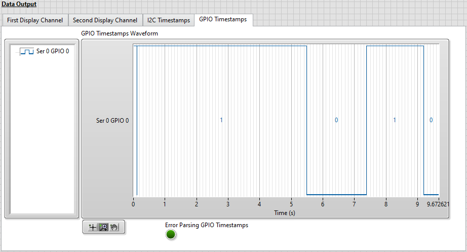

### Routing GPIO Lines

This tutorial shows you how to define GPIO line routes between GPIO banks on Serial Input/Output channel pairs. Routing GPIO lines means that the values read from the source GPIO lines are written to the destination GPIO lines on the FPGA. Manual GPIO writes performed from the host override the GPIO routes. 
> Notes: 
> - This tutorial only applies to interface modules with serial input _and_ serial output channels since GPIO routing is done between pairs of input and output channels.
> - The [Creating a TDMS File for the GPIO Tutorial](#creating-a-tdms-file-for-the-gpio-tutorial) section should be run prior to running the steps in this tutorial.
> - The focus of this tutorial is on configuring GPIO routes, not manually reading and writing to GPIO or displaying digital waveforms of GPIO timestamps. For more detailed descriptions of those topics, see [Manually Reading and Writing to GPIO](#manually-reading-and-writing-to-gpio).

1. Select the **GPIO** tab and make the following modifications.
    - Add a GPIO route at index 0 of the **GPIO Routes** array with the following settings.
        - Select **SI to SO** in the **Direction** control.
        - Set **Serial Channel** to 0.
        - Select **GPIO 0** in the **Source** control.
        - Select **GPIO 3** in the **Destination** control.

    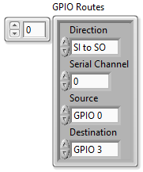

    - Add a GPIO route at index 1 of the **GPIO Routes** array with the following settings.
        - Select **SI to SO** in the **Direction** control.
        - Set **Serial Channel** to 0.
        - Select **GPIO 1** in the **Source** control.
        - Select **GPIO 0** in the **Destination** control.

    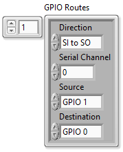

    > These settings define the GPIO routes shown below.
    >
    > | From (Source) | To (Destination) |
    > |---|---|
    > | SI 0 Deserializer Line 0 | SO 0 Serializer Line 3|
    > | SI 0 Deserializer Line 1 | SO 0 Serializer Line 0 |

    - Update the **GPIO to Display** array with the following settings.
        - At index 0 select **Des0 GPIO** in the **GPIO Bank** control and set the **GPIO Number** to 0. 
        - At index 1 select **Des0 GPIO** in the **GPIO Bank** control and set the **GPIO Number** to 1.
        - At index 2 select **Ser0 GPIO** in the **GPIO Bank** control and set the **GPIO Number** to 0. 
        - At index 3 select **Ser0 GPIO** in the **GPIO Bank** control and set the **GPIO Number** to 3.

    - Select **SI 0 Deserializer** from the **GPIO Bank Select** drop down menu.

    - In the **GPIO Bank Output Enable** cluster, enable the **GPIO 0** and **GPIO 1** controls.

   > The settings on the **GPIO** tab are now similar to the image below.
   
   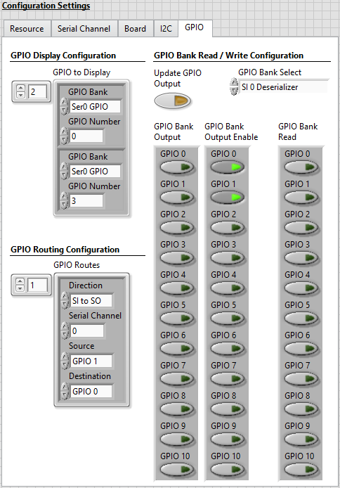

3. Run the VI, wait for the **Waiting for Serializer Setup** indicator to illuminate, and click the **Serializer Setup Complete** control button to start the generation.

4. Click **Update GPIO Output** to write false values to the lines 0 and 1 on the SI 0 Deserializer GPIO bank.

5. Set the **GPIO 0** button in the **GPIO Bank Output** control to true then click the **Update GPIO Output** button to write a true value to line 0 on the SI 0 Deserializer GPIO bank.

6. Set the **GPIO 1** button in the **GPIO Bank Output** control to true then click the **Update GPIO Output** button to write a true value to line 1 on the SI 0 Deserializer GPIO bank.

7. Set the **GPIO 0** and **GPIO 1** buttons in the **GPIO Bank Output** control to false then click the **Update GPIO Output** button to write a false values to lines 0 and 1 on the SI 0 Deserializer GPIO bank.

8. Click the **Stop Generation** button.

9. Once the VI stops running, click on the **GPIO Timestamps** tab to view a digital waveform of the selected GPIO lines.

    > GPIO timestamp data is displayed in the **GPIO Timestamps Waveform** digital waveform indicator. The waveforms observed are for the sources and the destinations of the defined GPIO routes. Notice that the values written to the source GPIO lines match the values read on the destination GPIO lines.

    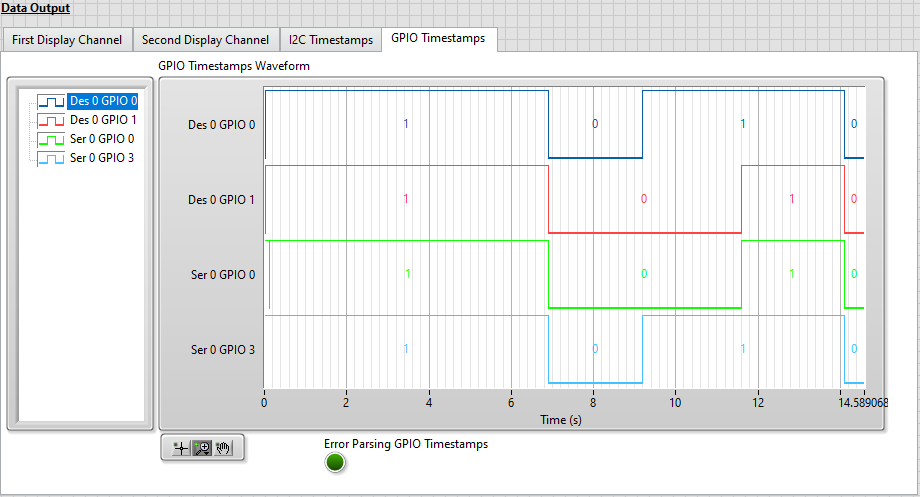

## Related Documents
- [PXIe-148X Getting Started Example - Basic Generation Tutorial](./gse-gen-basic.md)
- [PXIe-148X Getting Started Example - Generation Help](../../reference/gettingstartedexample/gse-gen-help.md)
- [PXIe-148X Getting Started Example - Common Acquisition Tutorials](./gse-acq-common.md)
- [PXIe-148X Getting Started Example - Common Tap Tutorials](./gse-tap-common.md)
