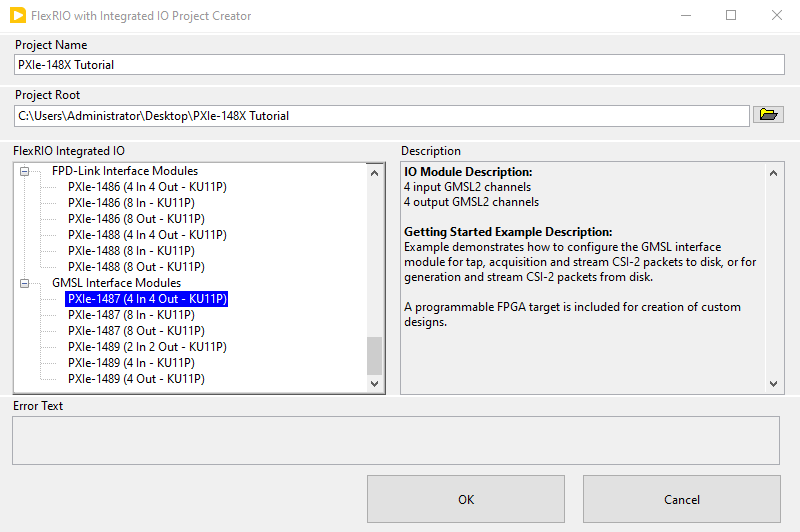

# PXIe-148X Getting Started Example - SerDes Configuration Script Tutorial
{: .no_toc }

This tutorial teaches you the steps needed to run a serializer/deserializer (SerDes) configuration script using a PXIe-148X module and familiarize you with the basic functionality provided by the SerDes Configuration Script Example.

SerDes configuration scripts are used to configure serializers and deserializers through the I2C bus interface. The SerDes Configuration Script Example runs configuration scripts through the SerDes Configuration Utility executable and exposes all of the optional arguments for the utility, which makes the SerDes Configuration Script Example a good troubleshooting tool for SerDes configuration scripts. 

### Table of contents
{: .no_toc }

1. TOC
{:toc}

---

## Prerequisites

Review and complete all setup from the appropriate getting started guide:
- [PXIe-1486 Getting Started Guide](https://www.ni.com/docs/en-US/bundle/pxie-1486-getting-started/)
- [PXIe-1487 Getting Started Guide](https://www.ni.com/docs/en-US/bundle/pxie-1487-getting-started/)
- [PXIe-1488 Getting Started Guide](https://www.ni.com/docs/en-US/bundle/pxie-1488-getting-started/)
- [PXIe-1489 Getting Started Guide](https://www.ni.com/docs/en-US/bundle/pxie-1489-getting-started/)

Basic knowledge of LabVIEW and LabVIEW FPGA concepts. 

A supported interface module on a PXI system running a compatible Windows version.

| **Interface Modules** |
|-----------------------|
| PXIe-1486             |
| PXIe-1487             |
| PXIe-1488             |
| PXIe-1489             |

## Initial Hardware Setup

Complete installation of hardware as described in the Getting Started Guide for your interface module. No physical connections to other modules or devices are required to complete this tutorial.

## Initial Software Setup

1.  First complete installation of software specified in the Getting Started Guide linked above.
2.  Use the NI Example Finder to create a default project for your specific interface module.
    - Open LabVIEW and click **Help -> Find Examples...**
    
    
    - In the NI Example Finder dialog, double-click **Hardware Input and Output -> FlexRIO -> Integrated IO -> Getting Started -> Getting Started FlexRIO Integrated IO.vi**
    
    - In the FlexRIO with Integrated IO Project Creator dialog set the **Project Name** to PXIe-148X Tutorial and make the **FlexRIO Integrated IO** selection for the desired PXIe-148X interface module then click **OK**.
    

3.  Double click the SerDes Configuration Script Example VI in the LabVIEW project.

    

    > The opened front panel of the Getting Started Example is similar to the figure below.

    

## Running a SerDes Configuration Script

1. Select the **RIO Device** from the dropdown menu that corresponds to your interface module.
2. Set the **Bitfile Path** to the bitfile that corresponds to your interface module. The default shipping bitfiles are in the 'FPGA Bitfiles' subfolder located in the project folder (created at the Project Root location specified in Project Creator).
3. (Optional) Modify the **SerDes Script Utiltiy Server Configuration** controls.
   - The SerDes Configuration Utility runs as a TCP socket server and the example VI executes scripts with TCP client write commands. The **TCP Socket Connection** control is used to modify the TCP socket settings.
   - The **Verbose** control increases the output verbosity of the SerDes Configuration Utility when enabled.
   - The stdout from the SerDes Configuration Utility is redirected to the file selected in the **Output File** control. A default output file is automatically chosen if left empty. The contents of the output file are displayed in the **SerDes Configuration Utility Server Output** indicator when the VI is run.

    > The configuration values are now similar to the figure below.

    

4. Run the VI and wait for the **Running** indicator to illuminate.
5. Add a serial channel to the **Serial Channels** array control using a valid serial channel for interface module in the format "SI" for Serial Input or "SO" for Serial Output followed by the channel number (i.e. "SI0"). The configuration script is run on the I2C bus or buses associated with the serial channels specified in this array.
6. Select a **Configuration Script Path** that corresponds to a valid configuration script for your interface module and channel type. The scripts are used to configure the deserializer on the interface module as well as the serializer and image sensor on the camera. The configuration scripts provided with the getting started example are in the project folder under the subfolder 'Host\\Scripts'.
 
    > The **SerDes Script Utility Client Commands** values are now similar to the figure below.

    

7. Click the **Run Script** button to execute the configuration script and view the SerDes Configuration Utility output in the **SerDes Configuration Utility Server Output** indicator.
8. Click the **Close** button to close the TCP socket connection to the SerDes Configuration Utility and stop the VI.

## Related Documents
- [PXIe-148X Configuration Scripts User Guides](../../reference/config-scripts-user-guide.md)