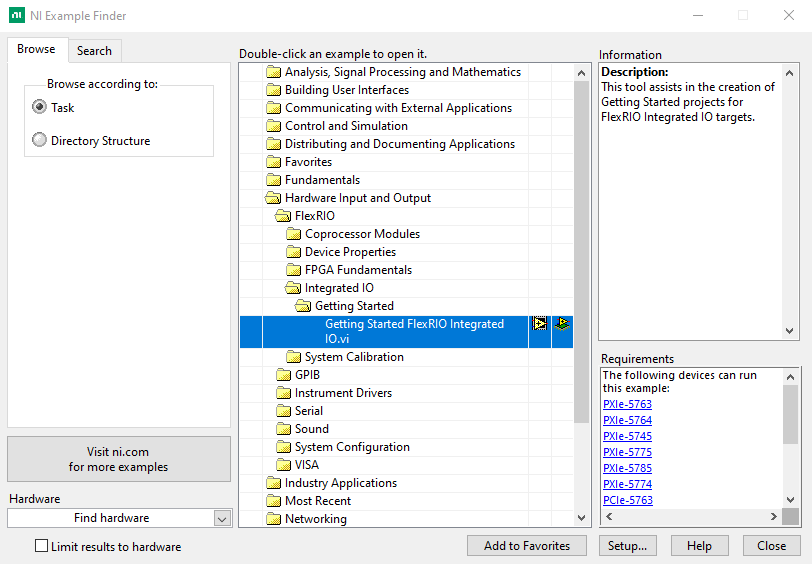
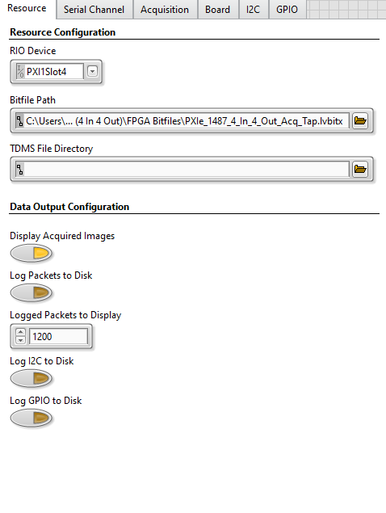
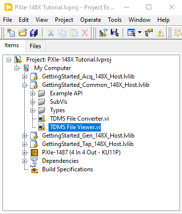
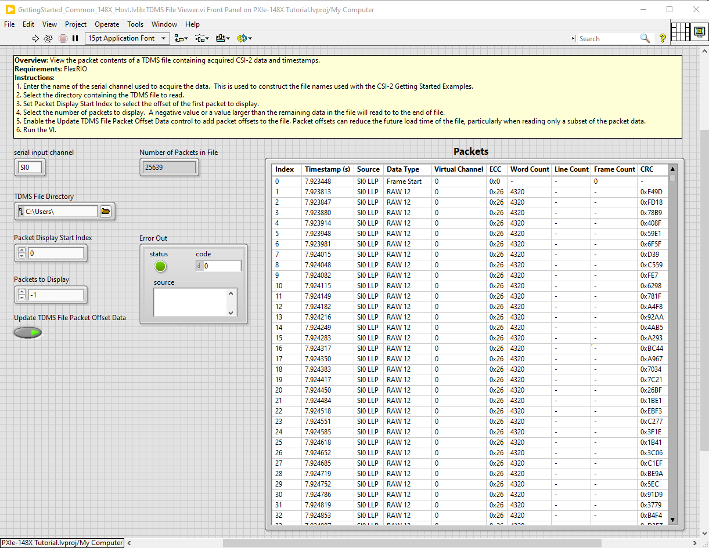

# PXIe-148X Getting Started Example - Basic Tap Tutorial
{: .no_toc }

This tutorial will teach you the steps needed to configure a tap acquisition using two PXIe-148X modules with a Leopard Imaging IMX490 camera and familiarize you with the basic functionality provided by the Tap Getting Started Example. A tap acquisition is defined as an acquisition with a CSI-2 sensor where data is forwarded from a serial input channel to a paired serial output channel while also logging acquired data and timestamps to disk. In addition, the Tap Getting Started Example bridges the I2C communication between the paired serial input and serial output channels. 

> Note: This document references the example included with the NI-FlexRIO 23Q1 driver. Examples included in newer releases of the driver should be applicable.

### Table of contents
{: .no_toc }

1. TOC
{:toc}

---

## Prerequisites

Review and complete all setup from the [PXIe-1486 Getting Started Guide](https://www.ni.com/docs/en-US/bundle/pxie-1486-getting-started/) or [PXIe-1487 Getting Started Guide](https://www.ni.com/docs/en-US/bundle/pxie-1487-getting-started/).

Basic knowledge of LabVIEW and LabVIEW FPGA concepts. 

A camera supported by the getting started example configuration scripts (i.e. Leopard Imaging IMX490).

A supported interface module that includes both serial input and serial output channels (tap module) and a second supported interface module that includes serial input channels (acq module) on a PXI system running Windows.

| **Interface Module**   | **Camera**                                                                                                                                                 |
|------------------------|------------------------------------------------------------------------------------------------------------------------------------------------------------|
| PXIe-1486 (8 In - 954 Deserializer)         | [LI-IMX490-FPDLINKIII](https://www.leopardimaging.com/product-category/autonomous-camera/ti-fpdlinkiii-cameras/li-imx490-fpdlinkiii/) |
| PXIe-1486 (4 In 4 Out - 953/954 SerDes)     | [LI-IMX490-FPDLINKIII](https://www.leopardimaging.com/product-category/autonomous-camera/ti-fpdlinkiii-cameras/li-imx490-fpdlinkiii/) |
| PXIe-1487 (8 I - 9296A Deserializer)        | [LI-IMX490-GMSL2](https://www.leopardimaging.com/product-category/autonomous-camera/maxim-gmsl2-cameras/li-imx490-gmsl2/)             |
| PXIe-1487 (4 In 4 Out - 9295A/9296A SerDes) | [LI-IMX490-GMSL2](https://www.leopardimaging.com/product-category/autonomous-camera/maxim-gmsl2-cameras/li-imx490-gmsl2/)             |

> Note: The tap and acq modules used in this tutorial must have matching model numbers (i.e. 1486).

## Initial Hardware Setup

1.  First complete installation of hardware as described in the Getting Started Guide linked above.
2.  Connect the camera to serial input channel 0 (SI0) on the tap module with a FAKRA cable.
3.  Connect serial output channel (SO0) on the tap module to serial input channel (SI0) on the acq module with a FAKRA cable.
4.  Connect the SI0 pin to the SO0 pin on the AUX POWER connector on the front panel of the tap module.

## Initial Software Setup

1.  First complete installation of software specified in the Getting Started Guide linked above.
2.  Use the NI Example Finder to create a default project for your specific tap module.
    - Open LabVIEW and click **Help -> Find Examples...**
    
    
    
    - In the NI Example Finder dialog, double-click **Hardware Input and Output -> FlexRIO -> Integrated IO -> Getting Started -> Getting Started FlexRIO Integrated IO.vi**
    
    

    - In the FlexRIO with Integrated IO Project Creator dialog set the **Project Name** to PXIe-148X Tutorial and make the **FlexRIO Integrated IO** selection for the desired PXIe-148X interface module then click **OK**.
    
    

3.  Double click the Tap Example VI in the LabVIEW project.

    

    > The opened front panel of the Getting Started Example is similar to the figure below.

    

4. Open an Acquisition Example VI (see [Basic Acquisition Tutorials - Initial Software Setup](./gse-acq-basic.md#initial-software-setup)).
    > Note: If the acq module is the same as the tap module, there is no need to create a new project. If the acq module is not the same as the tap module, a new project needs to be created for the acq module in order for the acq module FPGA bitfiles to be included in the project.

## Performing a Simple Continuous Tap Acquisition

> Note: For the purposes of this tutorial, all steps reference the Tap Example VI unless otherwise specified and all input control values not specified should be left as the default value.

1.  Select the **Resource** tab and make the following modifications.
    - Select the **RIO Device** from the dropdown menu that corresponds to your tap module.
    - Set the **Bitfile Path** to the bitfile that corresponds to your tap module. The default shipping bitfile is in the 'FPGA Bitfiles' subfolder located in the project folder (created at the Project Root location specified in Project Creator):

    | **Interface Module**   | **Bitfile**                                          |
    |------------------------|------------------------------------------------------|
    | PXIe-1486 (4 In 4 Out) | FPGA Bitfiles\\PXIe_1486_4\_In_4\_Out_Acq_Tap.lvbitx |
    | PXIe-1487 (4 In 4 Out) | FPGA Bitfiles\\PXIe_1487_4\_In_4\_Out_Acq_Tap.lvbitx |

    > The values on the **Resource** tab of **Configuration Settings** are now similar to the figure below.

    

2.  Select the **Serial Channel** tab and make the following modifications.
    - Select the **Deserializer (Input) Configuration Script** and **Serializer (Output) Configuration Script** that correspond to your interface module. The tap scripts are used to configure the deserializer and the serializer on the interface module to establish the I2C communication bridge between input and output channel pairs. See the [PXIe-148X Configuration Scripts User Guide](../../reference/gettingstartedexample/config-scripts-user-guide.md) for more details. The configuration scripts required for this tutorial are in the project folder under the subfolder 'Host\\Scripts':

        | **Interface Module**                         | **Deserializer (Input) Configuration Script**         |
        |----------------------------------------------|-------------------------------------------------------|
        | PXIe-1486 (4 In 4 Out - 953/954 SerDes)      | Host\\Scripts\\DS90UB954\\Tap\\Des_Tap.py             |
        | PXIe-1487 (4 In 4 Out - 9295A/9296A SerDes)  | Host\\Scripts\\MAX9296A\\Tap\\RAW12_ID01_Des_Tap.cpp  |
        | PXIe-1487 (4 In 4 Out - 96717/96716A SerDes) | Host\\Scripts\\MAX96716A\\Tap\\RAW12_ID12_Des_Tap.cpp |
        | PXIe-1488 (4 In 4 Out - 971/9702 SerDes)     | Host\\Scripts\\DS90UB9702\\Tap\\Des_Tap.py            |

        | **Interface Module**                         | **Serializer (Output) Configuration Script**        |
        |----------------------------------------------|-----------------------------------------------------|
        | PXIe-1486 (4 In 4 Out - 953/954 SerDes)      | Host\\Scripts\\DS90UB953\\Tap\\Ser_Tap.py           |
        | PXIe-1487 (4 In 4 Out - 9295A/9296A SerDes)  | Host\\Scripts\\MAX9295A\\Tap\\RAW12_ID1_Ser_Tap.cpp |
        | PXIe-1487 (4 In 4 Out - 96717/96716A SerDes) | Host\\Scripts\\MAX96717\\Tap\\RAW12_ID2_Ser_Tap.cpp |
        | PXIe-1488 (4 In 4 Out - 971/9702 SerDes)     | Host\\Scripts\\DS90UB971\\Tap\\Ser_Tap.py           |

    > The values on the **Serial Channel** tab of **Configuration Settings** are now similar to the figure below.

    

3.  Select the **Board** tab and make the following modifications.
    - In the **Power Over Coax Source** drop down menu, select **Auxiliary** to power the attached camera from the AUX POWER connector.
    - In the **Power Over Coax Sink** drop down menu, select **Auxiliary** to route received power over coax to the AUX POWER connector.

    > The values on the **Board** tab of **Configuration Settings** are now similar to the figure below.

    

4.  Run the VI to setup the tap configuration. 

    The Tap example loads the bitfile and applies the configuration settings, including execution of the deserializer and serializer configuration scripts. The **Waiting for Sensor Setup** indicator illuminates to indicate the configuration scripts have completed and the I2C communication bridge is established between serial input and serial output channel pairs.

5.  Click the **Sensor Setup Complete** control button to start a continuous tap acquisition. 
    
    The **Acquisition In Progress** indicator illuminates to indicate that the tap acquisition is running, but no data is received at this point since the camera configuration is performed from the Acquisition Example VI.

6. On the Acquisition Example VI, run the [Performing a Simple Continuous Acquisition](./gse-acq-basic.md#performing-a-simple-continuous-acquisition) tutorial using the acq module, but do not run the final step that stops the acquisition.

7.  Update the **Red Gain**, **Green Gain**, and **Blue Gain** display parameters on the **Serial Channel** tab -> **Channel Configurations** control to match any changes that were made on the Acquisition Example VI.

    

    > Note: Changes made to the **RAW Display Parameters** will take effect while the VI is running.

8.  While the Tap Example and Acquisition Example VIs are running, select the **First Display Channel** tab on the Tap Example and on the Acquisition Example and verify that images from the camera are displayed on these tabs. The images should look identical.

    

9.  Click the **Stop Acquisition** button on both Example VIs to stop the tap acquisition and stop the VIs.

## Performing a Finite Tap Acquisition with Data Logging

> Note: The Finite Tap Acquisition with Data Logging tutorial assumes that all input parameters are still configured as specified in the Simple Continuous Tap Acquisition tutorial for both the Tap and Acquisition Example VIs. All steps reference the Tap Example VI unless otherwise specified

1.  Select the **Resource** tab and make the following modifications.
    - Enable **Log Packets to Disk**.
    - Enable **Log I2C to Disk**.
    - Enable **Log GPIO to Disk**.

    > Note: During the first run of the VI in the Simple Continuous Tap Acquisition tutorial, the **TDMS File Directory** control was automatically populated with a value pointing to a subfolder (\"TDMS Files\"). This subfolder was automatically created within the project folder to store any generated TDMS files.

    > The values on the **Resource** tab of **Configuration Settings** are now similar to the figure below.
    
    

2.  Select the **Acquisition** tab and disable **Continuous Acquisition**.

    > The values on the **Acquisition** tab of **Configuration Settings** are now similar to the figure below.

    

3.  Select the **I2C** tab and add **User24** to the **timestamp filter** array to enable I2C timestamp logging on the SI0 channel.

    > The values on the **I2C** tab of **Configuration Settings** are now similar to the figure below.

    

4.  Select the **GPIO** tab and make the following modifications.
    - Add a GPIO line to the **GPIO to Display** array with the GPIO Bank value set to **Des0 GPIO** and the GPIO Number set to 0. Setting these values enables display of GPIO traffic for the GPIO 0 line on the SI0 channel connected to the camera.

    > The values on the **GPIO** tab of **Configuration Settings** are now similar to the figure below.

    

5.  Run the VI to setup the tap configuration and wait for the **Waiting for Sensor Setup** indicator to illuminate.
6.  Run the Acquisition Example VI and wait for the **Acquisition In Progress** indicator to illuminate on the Acquisition Example VI.

7.  Click the **Sensor Setup Complete** control button to start the tap acquisition and wait for the acquisition to complete. The default acquisition duration of 1 second is run and results are displayed on the various tabs in the **Data Output** indicator.

    > Packet Data is displayed in the **First Serial Channel Packets** tab.
    - The **Bytes Acquired (1st Channel)** indicator updates as the acquisition is occurring.
    - The **Packets Logged (1st Channel)** indicator updates after acquisition completes.
    > See [PXIe-148X Tap GSE Help](../../reference/gettingstartedexample/gse-tap-help.md#table-of-descriptions-for-acquired-packets-columns) for **Acquired Packets (1st Channel)** column details.

    

    > I2C timestamp data is displayed in the **I2C Timestamps** tab.

    

8.  GPIO timestamp data is plotted in the **GPIO Timestamps** tab.

    

    > Note: The camera does not toggle GPIOs by default. The change shown in the figure above reflects GPIO level reset when the example VI is first run.

## Reviewing Previously Logged Data

> Note: The Reviewing Previously Logged Data tutorial assumes that the previous tutorials in this document were completed first.

TDMS files containing acquired data from the camera were saved to the \"TDMS Files\" subfolder in the previous tutorial. The GPIO timestamps, user timestamps, and data acquired from the camera are stored in individual TDMS files. You can use the file viewer utility to review the acquired packet data.

1.  Double click the TDMS File Viewer VI in the LabVIEW project.
  
    

    > The opened front panel of the File Viewer will be similar to the figure below.

    

2.  Select the correct location for the **TDMS File Directory** control. By default, TDMS files in the previous tutorial were saved to `<yourprojectdir>\Host\Tap\TDMS Files`.

    > Note: The directory browse window will not show the TDMS files located in the "TDMS Files" directory.

3.  Run the VI to load the TDMS file and view the packet data.

    

    > Note: The **Update TDMS File Packet Offset Data** control is enabled by default. Enabling this option results in re-saving a TDMS file with additional packet indexing information the first time the TDMS file is loaded. This indexing information can reduce the future load time of the file, particularly when reading only a subset of the packet data.

4. (Optional) Update the **Packet Display Start Index** and **Packets to Display** controls to review a specific packet range of interest from the TDMS file and rerun the VI. 
    > Using an LI-IMX490-GMSL2 camera with a vertical resolution of 1280, each frame contains a Frame Start packet followed by 1280 RAW 12 packets and a Frame End packet. To display 10 frames of data starting at the second frame, set **Packet Display Start Index** to 1282 and **Packets to Display** to 12820.

    > Note: Setting **Packets to Display** to -1 displays packets from **Packet Display Start Index** to the end of the file.

## Related Documents
- [PXIe-148X Getting Started Example - Common Tap Tutorials](./gse-tap-common.md)
- [PXIe-148X Getting Started Example - Tap Help](../../reference/gettingstartedexample/gse-tap-help.md)
- [PXIe-148X Getting Started Example - Basic Acquisition Tutorial](./gse-acq-basic.md)
- [PXIe-148X Getting Started Example - Basic Generation Tutorial](./gse-gen-basic.md)

    
