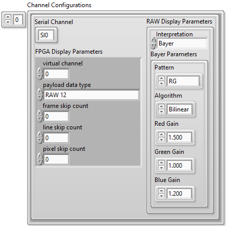

# PXIe-148X Getting Started Example - Common Tap Tutorials

This document covers a range of common scenarios using the PXIe-148X Tap Getting Started Example (GSE) to help you understand LLP generation, I2C and GPIO timestamping, and common configuration options.

> Note: This document references the example included with the NI-FlexRIO 23Q3 driver. Examples included in newer releases of the driver should be applicable.

### Table of contents
{: .no_toc }

1. TOC
{:toc}

---

## Prerequisites
A supported interface module that includes both serial input and serial output channels (tap module) and a second supported interface module that includes serial input channels (acq module) on a PXI system running Windows.

A camera supported by the getting started example configuration scripts (i.e. Leopard Imaging IMX490) or a third supported interface module that includes serial output channels (gen module).

| **Interface Module**                        | **Camera**                                                                                                                            |
|---------------------------------------------|---------------------------------------------------------------------------------------------------------------------------------------|
| PXIe-1486 (8 In - 954 Deserializer)         | [LI-IMX490-FPDLINKIII](https://www.leopardimaging.com/product-category/autonomous-camera/ti-fpdlinkiii-cameras/li-imx490-fpdlinkiii/) |
| PXIe-1486 (4 In 4 Out - 953/954 SerDes)     | [LI-IMX490-FPDLINKIII](https://www.leopardimaging.com/product-category/autonomous-camera/ti-fpdlinkiii-cameras/li-imx490-fpdlinkiii/) |
| PXIe-1487 (8 I - 9296A Deserializer)        | [LI-IMX490-GMSL2](https://www.leopardimaging.com/product-category/autonomous-camera/maxim-gmsl2-cameras/li-imx490-gmsl2/)             |
| PXIe-1487 (4 In 4 Out - 9295A/9296A SerDes) | [LI-IMX490-GMSL2](https://www.leopardimaging.com/product-category/autonomous-camera/maxim-gmsl2-cameras/li-imx490-gmsl2/)             |

> Note: The tap and acq modules used in this tutorial must have matching model numbers (i.e. 1486).

This tutorial is written for users who understand how to perform a basic tap acquisition with PXIe-148X GMSL or FPD-Link interface modules. At a minimum it is required that you complete the [Initial Hardware Setup](gse-tap-basic.md#initial-hardware-setup) and [Initial Software Setup](gse-tap-basic.md#initial-software-setup) from the PXIe-148X Getting Started Example - Basic Tap Tutorial before starting this tutorial.

> Note: Tutorials in this document use one tap LabVIEW project and one acquisition LabVIEW project as well as a camera or a generation LabVIEW project to provide the image data to the tap module serial input. All tutorial steps in this document reference the Tap Example VI unless otherwise specified and all input control values not specified should be left as the default value.

## Running a Generation-Tap-Acquisition Getting Started Example Combination
This tutorial uses a gen module, tap module and acq module to demonstrate basic tap capabilities using a gen module in place of a camera. The sequence for this tutorial is configure generation example, configure tap example, configure acquisition example, start acquisition example, start tap example, start generation example, wait for generation example to complete, stop acquisition example, stop tap example.

1. Disconnect the camera from serial input channel 0 (SI0) on the tap module and connect serial output channel 0 (SO0) on the gen module to serial input channel 0 (SI0) on the tap module with a FAKRA cable.

2. Open a Generation Example VI (see [Basic Generation Tutorials - Initial Software Setup](./gse-gen-basic.md#initial-software-setup)) and run [Basic Generation Tutorials - Create TDMS Files for Generation](./gse-gen-basic.md#create-tdms-files-for-generation).
    > Note: If the gen module is the same module type as the tap module, there is no need to create a new project. If the gen module is not the same module type as the tap module, a new project needs to be created for the gen module in order for the gen module FPGA bitfiles to be included in the project.

3. On the Generation Example VI, run the [Performing a Simple Generation](./gse-gen-basic.md#performing-a-simple-generation) tutorial using the gen module, but do not run the final step that starts the generation.

4. Set the following controls on the Tap Example VI and leave all other values at their defaults.
    > Note: VI controls and indicators can be reset to default values by clicking on the **Edit** menu and selecting the **Reinitialize Values to Default** option.

    | Tab | Control | Value |
    |---|---|---|
    | **Resource** | **RIO Device** | [System Specific] |
    | **Resource** | **Bitfile Path** | [Refer to Bitfile Path in the PXIe-148X Tap GSE Help](../../reference/gettingstartedexample/gse-tap-help.md#table-of-pxie-148x-tap-bitfiles) |
    | **Serial Channel** | **Deserializer (Input) Configuration Script** | [Refer to Deserializer Tap Scripts in the PXIe-148X Tap GSE Help](../../reference/gettingstartedexample/gse-tap-help.md#table-of-pxie-148x-deserializer-tap-scripts) |
    | **Serial Channel** | **Serializer (Output) Configuration Script** | [Refer to Serializer Tap Scripts in the PXIe-148X Tap GSE Help](../../reference/gettingstartedexample/gse-tap-help.md#table-of-pxie-148x-serializer-tap-scripts) |

5. Run the Tap Example VI and wait for the **Waiting for Sensor Setup** indicator to illuminate.

6. On the Acquisition Example VI set the following controls and leave all other values at their defaults.
    > Note: VI controls and indicators can be reset to default values by clicking on the **Edit** menu and selecting the **Reinitialize Values to Default** option.

    | Tab | Control | Value |
    |---|---|---|
    | **Resource** | **RIO Device** | [System Specific] |
    | **Resource** | **Bitfile Path** | [Refer to Bitfile Path in the PXIe-148X Acquisition GSE Help](../../reference/gettingstartedexample/gse-acq-help.md#table-of-pxie-148x-acquisition-bitfiles) |
    | **Serial Channel** | **Configuration Script** | Loopback Script - [Refer to Acquisition Scripts in the PXIe-148X Configuration Scripts User Guide](../../reference/gettingstartedexample/config-scripts-user-guide.md#acquisition-scripts) |

7. Run the Acquisition Example VI and wait for the **Acquisition In Progress** indicator to illuminate.

8. On the Tap Example VI, click **Sensor Setup Complete** to start the tap acquisition.

9. On the Generation Example VI, click **Serializer Setup Complete** to start the generation and wait for the generation to complete.

10. Select the First Display Channel tab on the Generation, Tap and Acquisition Examples and verify that images from the generated TDMS file are displayed on these tabs. The images should look identical.

10. Click the **Stop Acquisition** button on both the Tap and Acquisition Example VIs to stop the tap acquisition and stop the VIs.

## Logging and Displaying I2C Timestamps
This tutorial shows how to acquire and view I2C timestamps on the PXIe-148X interface module across a tap bridge using the tap and acquisition getting started examples.  

> Note: Timestamps are relative to a time immediately after the FPGA bitfile is downloaded and run, not the start of the acquisition. This allows capturing I2C and GPIO timestamps during configuration before the acquisition starts.

1. Set the following controls on the Tap Example VI and leave all other values at their defaults.
    > Note: VI controls and indicators can be reset to default values by clicking on the **Edit** menu and selecting the **Reinitialize Values to Default** option.

    | Tab | Setting | Value |
    |---|---|---|
    | **Resource** | **RIO Device** | [System Specific] |
    | **Resource** | **Bitfile Path** | [Refer to Bitfile Path in the PXIe-148X Tap GSE Help](../../reference/gettingstartedexample/gse-tap-help.md#table-of-pxie-148x-tap-bitfiles) |
    | **Resource** | **Log I2C to Disk** | **Enabled** |
    | **Serial Channel** | **Deserializer (Input) Configuration Script** | [Refer to Deserializer Tap Scripts in the PXIe-148X Tap GSE Help](../../reference/gettingstartedexample/gse-tap-help.md#table-of-pxie-148x-deserializer-tap-scripts) |
    | **Serial Channel** | **Serializer (Output) Configuration Script** | [Refer to Serializer Tap Scripts in the PXIe-148X Tap GSE Help](../../reference/gettingstartedexample/gse-tap-help.md#table-of-pxie-148x-serializer-tap-scripts) |
    | **Board** | **Power Over Coax Source** | **Internal** |

2.  Select the **I2C** tab and make the following modifications.

    > The I2C tab only has one control, the I2C **timestamp filter**. This filter contains an array of timestamp IDs. **User24** represents the I2C traffic on serial channel 0 (SI0), **User25** represents the I2C traffic on serial channel 1 (SI1), and so on.
    - Set the **timestamp filter** array to contain only the **User24** timestamp ID. This will let you see the I2C traffic on the SI0 and SO0 channel pair. If you run the VI with a configuration script selected, you will see configuration traffic in the I2C Data Output tab after the VI has stopped.

    

3.  On the Acquisition Example VI set the following controls and leave all other values at their defaults.
    > Note: VI controls and indicators can be reset to default values by clicking on the **Edit** menu and selecting the **Reinitialize Values to Default** option.

    | Tab | Control | Value |
    |---|---|---|
    | **Resource** | **RIO Device** | [System Specific] |
    | **Resource** | **Bitfile Path** | [Refer to Bitfile Path in the PXIe-148X Acquisition GSE Help](../../reference/gettingstartedexample/gse-acq-help.md#table-of-pxie-148x-acquisition-bitfiles) |
    | **Resource** | **Log I2C to Disk** | **Enabled** |
    | **Serial Channel** | **Configuration Script** | [Refer to Configuration Script in the PXIe-148X Acquisition GSE Help](../../reference/gettingstartedexample/gse-acq-help.md#table-of-pxie-148x-acquisition-scripts) |
    | **Acquisition** | **Continuous Acquisition** | **Disabled** |

4.  On the Acquisition Example VI, select the **I2C** tab and make the following modifications.

    - Set the **timestamp filter** array to contain only the **User24** timestamp ID.

    

5.  Run the Tap Example VI and wait for the **Waiting for Sensor Setup** indicator to illuminate then click **Sensor Setup Complete**.
6.  Run the Acquisition Example VI and wait for the acquisition to complete.
7.  Click the **Stop Acquisition** button on the Tap Example VI.
8.  Select the **I2C Timestamps** tab to view I2C timestamp data on both the Tap and Acquisition Example VIs.
    - View the displayed I2C timestamp data in the **I2C Timestamps** table. The **I2C Timestamps** table displays I2C timestamp information for all I2C traffic. I2C timestamps begin logging immediately after the FPGA bitfile is downloaded and include timestamp data prior to the start of the LLP packet data acquisition (i.e. I2C traffic from the configuration script).
    - The first set of timestamps in the displayed will correspond to the script defined by the **Deserializer (Input) Configuration Script** control. The next set of timestamps displayed will correspond to the script defined by the **Serializer (Output) Configuration Script** control. The last set of timestamps will correspond to the script defined by the **Configuration Script** control on the Acquisition Example VI. 
    - Note that the tap scripts change the addresses for the serializer and deserializer in the tap channel pair, which prevents an address conflict when running the acquisition script. As a result, the acquisition configuration script I2C commands sent to the default deserializer address result in an ACK response from the acq module and a NACK response from the tap module, while the I2C commands sent to the camera address are passed though the tap bridge to the camera and result in an ACK response on both the tap and acq modules.

        > Note: To display I2C timestamp data, **Log I2C to Disk** must be enabled and desired timestamp IDs must be added to the **timestamp filter** array. The I2C timestamp data displayed is read from the User_Timestamps.tdms file and filtered to display only timestamp IDs included in the timestamp filer array. The **I2C Timestamps** display is updated after the acquisitions completes.

    

## Setting FPGA Display Parameters
This tutorial shows you how to configure the **FPGA Display Parameters** to change the images displayed during tap acquisition. 

The logic and front panel controls for FPGA display parameters are shared for all PXIe-148X getting started examples. Therefore, you can use the acquisition [Setting FPGA Display Parameters](gse-acq-common.md#setting-fpga-display-parameters) tutorial for for steps associated with setting FPGA display parameters on the Tap Example VI, while following the procedure specified in the [Performing a Simple Continuous Tap Acquisition](gse-tap-basic.md#performing-a-simple-continuous-tap-acquisition) tutorial for configuring and running the Tap and Acquisition Example VIs.

### Displaying Acquired Images
1. Complete the steps associated with setting FPGA display parameters in the acquisition [Displaying Acquired Images](gse-acq-common.md#displaying-acquired-images) tutorial while following the procedure specified in the [Performing a Simple Continuous Tap Acquisition](gse-tap-basic.md#performing-a-simple-continuous-tap-acquisition).

### Reducing System Bandwidth Usage
1. Complete the steps associated with setting FPGA display parameters in the acquisition [Reducing System Bandwidth Usage](gse-acq-common.md#reducing-system-bandwidth-usage) tutorial while following the procedure specified in the [Performing a Simple Continuous Tap Acquisition](gse-tap-basic.md#performing-a-simple-continuous-tap-acquisition).

## Setting RAW Display Parameters
This tutorial shows you how to configure the **RAW Display Parameters** to change the interpretation of images being displayed from the camera that are being sent in RAW packets.

The logic and front panel controls for RAW display parameters are shared for all PXIe-148X getting started examples. Therefore, you can use the acquisition [Setting RAW Display Parameters](gse-acq-common.md#setting-raw-display-parameters) tutorial for for steps associated with setting RAW display parameters on the Tap Example VI, while following the procedure specified in the [Performing a Simple Continuous Tap Acquisition](gse-tap-basic.md#performing-a-simple-continuous-tap-acquisition) tutorial for configuring and running the Tap and Acquisition Example VIs.

## Setting Serial Channel Configurations
This tutorial shows you how to configure the **Serial Channel** tab to acquire multiple images from multiple camera sensors.

Note: This tutorial requires the use of two Leopard Imaging IMX490 cameras connected to SI0 and SI1 of your tap module.

1. Set the following controls on the Tap Example VI and leave all other values at their defaults.
    > Note: VI controls and indicators can be reset to default values by clicking on the **Edit** menu and selecting the **Reinitialize Values to Default** option.

    | Tab | Control | Value |
    |---|---|---|
    | **Resource** | **RIO Device** | [System Specific] |
    | **Resource** | **Bitfile Path** | [Refer to Bitfile Path in the PXIe-148X Tap GSE Help](../../reference/gettingstartedexample/gse-tap-help.md#table-of-pxie-148x-tap-bitfiles) |
    | **Serial Channel** | **Deserializer (Input) Configuration Script** | [Refer to Deserializer Tap Scripts in the PXIe-148X Tap GSE Help](../../reference/gettingstartedexample/gse-tap-help.md#table-of-pxie-148x-deserializer-tap-scripts) |
    | **Serial Channel** | **Serializer (Output) Configuration Script** | [Refer to Serializer Tap Scripts in the PXIe-148X Tap GSE Help](../../reference/gettingstartedexample/gse-tap-help.md#table-of-pxie-148x-serializer-tap-scripts) |
    | **Board** | **Power Over Coax Source** | **Auxiliary** |

2. Set the following controls on the Acquisition Example VI and leave all other values at their defaults.
    > Note: VI controls and indicators can be reset to default values by clicking on the **Edit** menu and selecting the **Reinitialize Values to Default** option.

    | Tab | Control | Value |
    |---|---|---|
    | **Resource** | **RIO Device** | [System Specific] |
    | **Resource** | **Bitfile Path** | [Refer to Bitfile Path in the PXIe-148X Acquisition GSE Help](../../reference/gettingstartedexample/gse-acq-help.md#table-of-pxie-148x-acquisition-bitfiles)        |
    | **Serial Channel** | **Configuration Script** | [Refer to Configuration Script in the PXIe-148X Acquisition GSE Help](../../reference/gettingstartedexample/gse-acq-help.md#table-of-pxie-148x-acquisition-scripts) |
    | **Acquisition** | **Acquisition Duration** | 5 seconds |
    | **Acquisition** | **Continuous Acquisition** | **Disabled** |
    | **Board** | **Power Over Coax Source** | **Internal** |

### Displaying Acquired Images From Multiple Cameras
1. Select the **Serial Channel** tab and make the following modifications.

    The **Channel Configurations** control is used to select active channels and configure display parameters if enabled.

    Set the **Channel Configurations** array to contain two elements. Configure the first element with the following sub-settings.

    - Set the **Serial Channel Tap Pair** control to **input** SI0 and **output** SO0.
    - Set the **payload data type** to **RAW 12**.
	
	Configure the second element with the following sub-settings.
	
	- Set the **Serial Channel Tap Pair** control to **input** SI1 and **output** SO1.
    - Set the **payload data type** to **RAW 12**.

    > The values on the **Serial Channel** tab of **Configuration Settings** are now similar to the figure below.

    

2.  On the Acquisition Example VI, select the **Serial Channel** tab and make the following modifications.

    The **Channel Configurations** control is used to select active channels and configure display parameters if enabled.

    Set the **Channel Configurations** array to contain two elements. Configure the first element with the following sub-settings.

    - Set the **Serial Channel** control to SI0.
    - Set the **payload data type** to **RAW 12**.
	
	Configure the second element with the following sub-settings.
	
	- Set the **Serial Channel** control to SI1.
    - Set the **payload data type** to **RAW 12**.

    > The Acquisition Example VI values on the **Serial Channel** tab of **Configuration Settings** are now similar to the figure below.

    

3. Run the Tap Example VI and wait for the **Waiting for Sensor Setup** indicator to illuminate then click **Sensor Setup Complete**.
4. Run the Acquisition Example VI and wait for the acquisition to complete.
5. Click the **Stop Acquisition** button on the Tap Example VI.
   - Select the **First Display Channel** tab and observe the image from the Leopard Imaging IMX490 camera connected to SI0.
   - Select the **Second Display Channel** tab and observe the image from the Leopard Imaging IMX490 camera connected to SI1.

    > The images displayed on the Tap Example VI and Acquisition Example VI will match.

## Using the General Purpose Input/Output (GPIO) Lines

This section shows you how to configure routing of GPIO lines between GPIO banks as well as how to manually read and write to the GPIO banks on the PXIe-148X interface module. This procedure modifies GPIO line values while the tap acquisition is running, logs the GPIO timestamps to disk, and displays digital waveforms of the GPIO lines.

> Note: Timestamps are relative to a time immediately after the FPGA bitfile is downloaded and run, not to the start of the acquisition. This allows for capturing I2C and GPIO timestamps during configuration before the acquisition starts.

1. Set the following controls on the Tsp Example VI and leave all other values at their defaults.
    > Note: VI controls and indicators can be reset to default values by clicking on the **Edit** menu and selecting the **Reinitialize Values to Default** option.

    | Tab | Setting | Value |
    |---|---|---|
    | **Resource** | **RIO Device** | [System Specific] |
    | **Resource** | **Bitfile Path** | [Refer to Bitfile Path in the PXIe-148X Tap GSE Help](../../reference/gettingstartedexample/gse-tap-help.md#table-of-pxie-148x-tap-bitfiles) |
    | **Resource** | **Display Generated Images** | **Disabled** |
    | **Resource** | **Log GPIO to Disk** | **Enabled** |
    | **Serial Channel** | **Deserializer (Input) Configuration Script** | [Refer to Deserializer Tap Scripts in the PXIe-148X Tap GSE Help](../../reference/gettingstartedexample/gse-tap-help.md#table-of-pxie-148x-deserializer-tap-scripts) |
    | **Serial Channel** | **Serializer (Output) Configuration Script** | [Refer to Serializer Tap Scripts in the PXIe-148X Tap GSE Help](../../reference/gettingstartedexample/gse-tap-help.md#table-of-pxie-148x-serializer-tap-scripts) |

### Manually Reading and Writing to GPIO

This section shows you how to perform manual reads and writes to GPIO during the tap acquisition and how to display digital waveforms for the resulting GPIO timestamp data.

1. Select the **GPIO** tab and make the following modifications.
    - Update the **GPIO to Display** array with the following settings.
        - At index 0 select **Ser0 GPIO** in the **GPIO Bank** control and set the **GPIO Number** to 0. 

        > Setting these values enables display of GPIO traffic for GPIO line 0 on the SO0 channel. Optionally, add any additional GPIO lines to display.
        >
        > The **GPIO to Display** control specifies GPIO lines to display on the GPIO Timestamps Waveform after the acquisition completes. Timestamps for GPIO lines not included in the **GPIO to Display** array are logged but not displayed.

    - Select **SO0 Serializer** from the **GPIO Bank Select** drop down menu.
    
        > The **GPIO Bank Select** control specifies the GPIO bank used for the **GPIO Bank Output**, **GPIO Bank Output Enable**, and **GPIO Bank Read** controls during the acquisition. The **GPIO Bank Select** selection may be changed at runtime.

    - In the **GPIO Bank Output Enable** cluster, enable the **GPIO 0** control.
        > The **GPIO Bank Output Enable** controls are used as write enables for manual GPIO writes to override the defined GPIO routing. In this case, this option writes to line 0 of the GPIO selected on the **GPIO Bank Select** control and leaves all other lines in the bank unchanged.

   > The settings on the **GPIO** tab are now similar to the image below.
   
   

2. Run the VI, wait for the **Waiting for Sensor Setup** indicator to illuminate, and click the **Sensor Setup Complete** control button to start the tap acquisition.

3. Click **Update GPIO Output** to write a false value to line 0 on the SO 0 Serializer GPIO bank.
    > Notice that the **GPIO 0** Boolean indicator in the **GPIO Bank Read** cluster is not illuminated (false).

4. Set the **GPIO 0** button in the **GPIO Bank Output** control to true and then click the **Update GPIO Output** button to write a true value to line 0 on the SO 0 Serializer GPIO bank.
    > Notice that the **GPIO 0** Boolean indicator in the **GPIO Bank Read** cluster is illuminated (true).

5. Set the **GPIO 0** button in the **GPIO Bank Output** control to false and then click the **Update GPIO Output** button to write a false values to line 0 on the SO 0 Serializer GPIO bank.
    > Notice that the **GPIO 0** Boolean indicators in the **GPIO Bank Read** cluster are not illuminated (false).

6. Click the **Stop Acquisition** button.

7. Once the VI stops running, click on the **GPIO Timestamps** tab to view a digital waveform of the selected GPIO line(s).

    > GPIO timestamp data is displayed in the **GPIO Timestamps Waveform** digital waveform indicator. The pattern observed matches the sequence of manual writes that were performed on GPIO line 0 during the tutorial.
    
    > Note: The digital waveform is read from the GPIO_Timestamps.tdms file and filtered to display only timestamps for the GPIO lines included in the **GPIO to Display** array. The **GPIO Timestamps Waveform** display is updated after the acquisition completes.

    

### Routing GPIO Lines

This tutorial shows you how to define GPIO line routes between GPIO banks on Serial Input/Output channel pairs. A GPIO line *route* is the combination of a source GPIO line where data is read and of a destination GPIO line on the FPGA. Manual GPIO writes performed from the host override the GPIO routes. 
> Notes: 
> - This tutorial only applies to interface modules with both serial input and serial output channels since GPIO routing is done between pairs of input and output channels.
> - The focus of this tutorial is on configuring GPIO routes, not manually reading and writing to GPIO or displaying digital waveforms of GPIO timestamps. For more detailed descriptions of those topics, see [Manually Reading and Writing to GPIO](#manually-reading-and-writing-to-gpio).

1. Select the **GPIO** tab and make the following modifications.
    - Add a GPIO route at index 0 of the **GPIO Routes** array with the following settings.
        - Select **SI to SO** in the **Direction** control.
        - Set **Serial Channel** to 0.
        - Select **GPIO 0** in the **Source** control.
        - Select **GPIO 3** in the **Destination** control.

    

    - Add a GPIO route at index 1 of the **GPIO Routes** array with the following settings.
        - Select **SI to SO** in the **Direction** control.
        - Set **Serial Channel** to 0.
        - Select **GPIO 1** in the **Source** control.
        - Select **GPIO 0** in the **Destination** control.

    

    > These settings define the GPIO routes shown below.
    >
    > | From (Source) | To (Destination) |
    > |---|---|
    > | SI 0 Deserializer Line 0 | SO 0 Serializer Line 3|
    > | SI 0 Deserializer Line 1 | SO 0 Serializer Line 0 |

    - Update the **GPIO to Display** array with the following settings.
        - At index 0, select **Des0 GPIO** in the **GPIO Bank** control and set the **GPIO Number** to 0. 
        - At index 1, select **Des0 GPIO** in the **GPIO Bank** control and set the **GPIO Number** to 1.
        - At index 2, select **Ser0 GPIO** in the **GPIO Bank** control and set the **GPIO Number** to 0. 
        - At index 3, select **Ser0 GPIO** in the **GPIO Bank** control and set the **GPIO Number** to 3.

    - Select **SI 0 Deserializer** from the **GPIO Bank Select** drop down menu.

    - In the **GPIO Bank Output Enable** cluster, enable the **GPIO 0** and **GPIO 1** controls.

   > The settings on the **GPIO** tab are now similar to the image below.
   
   

3. Run the VI, wait for the **Waiting for Sensor Setup** indicator to illuminate, and click the **Sensor Setup Complete** control button to start the tap acquisition.

4. Click **Update GPIO Output** to write false values to lines 0 and 1 on the SI 0 Deserializer GPIO bank.

5. Set the **GPIO 0** button in the **GPIO Bank Output** control to true (illuminated) and then click the **Update GPIO Output** button to write a true value to line 0 on the SI 0 Deserializer GPIO bank.

6. Set the **GPIO 1** button in the **GPIO Bank Output** control to true and then click the **Update GPIO Output** button to write a true value to line 1 on the SI 0 Deserializer GPIO bank.

7. Set the **GPIO 0** and **GPIO 1** buttons in the **GPIO Bank Output** control to false and then click the **Update GPIO Output** button to write false values to lines 0 and 1 on the SI 0 Deserializer GPIO bank.

8. Click the **Stop Acquisition** button.

9. Once the VI stops running, click on the **GPIO Timestamps** tab to view a digital waveform of the selected GPIO lines.

    > GPIO timestamp data is displayed in the **GPIO Timestamps Waveform** digital waveform indicator. The waveforms observed are for the sources and the destinations of the defined GPIO routes. Notice that the values written to the source GPIO lines match the values read on the destination GPIO lines.

    

## Related Documents
- [PXIe-148X Getting Started Example - Basic Tap Tutorial](./gse-tap-basic.md)
- [PXIe-148X Getting Started Example - Tap Help](../../reference/gettingstartedexample/gse-tap-help.md)
- [PXIe-148X Getting Started Example - Common Acquisition Tutorials](./gse-acq-common.md)
- [PXIe-148X Getting Started Example - Common Generation Tutorials](./gse-gen-common.md)
